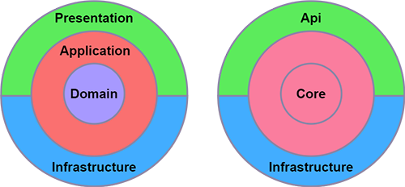

# Clean Architecture and Solid Principles

## Clean Architecture
**Clean Architecture** emphasizes separating concerns into distinct layers with well-defined responsibilities. The **SOLID principles** are applied within these layers to ensure that each layer is cohesive and loosely coupled to others, making the system more robust and easier to maintain.
For example, the Domain layer (containing core business logic) should be independent of the Infrastructure layer (database, external services).
- Clean Architecture is a software design approach that promotes the separation of concerns, ensuring systems are maintainable, scalable, and testable. By organizing code into distinct layers, each with a clear responsibility, Clean Architecture allows developers to build robust, flexible applications.
- By adhering to SOLID principles, developers can create a clean and well-structured codebase that is easier to understand, modify, and extend, leading to a more robust and maintainable system.

### Clean Architecture Layers
**Clean Architecture** divides an application into layers to separate concerns, improve maintainability, and promote testability. The layers, from innermost to outermost, are **Domain**, **Application**, **Infrastructure**, and **Presentation**. Each layer has a specific responsibility, and dependencies flow inward, toward the core domain.
1. **Domain Layer**         
   This is the heart of the application, containing the core business logic, entities, and rules.
   It's independent and should not depend on any other layer, ensuring it remains stable even if other layers change.
2. **Application Layer**      
   This layer defines use cases and orchestrates the application's functionality.
   It depends on the Domain layer but not on the outer layers (Infrastructure and Presentation).
   It acts as a bridge between the Domain and other layers, managing data flow and use case implementation.
3. **Infrastructure Layer**     
   This layer handles external concerns like databases, file systems, and APIs.
   It implements interfaces defined in the Application layer, providing concrete implementations for data access and other external interactions.
4. **Presentation Layer (In most cases API Layer)**     
   This layer is responsible for user interface interactions and displaying information.
   It depends on the Application layer and may use the Infrastructure layer for data retrieval and presentation.
   
By separating these concerns, Clean Architecture allows for easier maintenance, testing, and modification of the application, as changes in one layer have minimal impact on others.

### Clean Architecture Example 
In his example the first picture demonstrates Clean Architecture layers diagram. 

The second picture is an example of the minimalistic approach of Clean Architecture with 3 layers.
In this setup, the architecture is intentionally simplified into three layers: core(also known as domain), API, and infrastructure. Instead of following the typical four-layer model (core/domain, application, infrastructure, and presentation), we chose to merge the core and application layers into a single, unified core layer.
- Core Layer (Domain Layer)
- API Layer (Presentation Layer)
- Infrastructure Layer

## Design Principles in Clean Architecture: Solid Principles
Clean Architecture adheres to several design principles, also called [**SOLID Principles**](./solid-principles.md) that guide the structuring of software systems to promote maintainability, scalability, and testability.  
These principles are **Single Responsibility**, **Open/Closed**, **Liskov Substitution**, **Interface Segregation**, and **Dependency Inversion**.

## Documentation and References
- [Next-Level Boilerplate: An Inside Look Into Our .Net Clean Architecture Repo](https://devblogs.microsoft.com/ise/next-level-clean-architecture-boilerplate/)
- [Complete Guide to Clean Architecture](https://www.geeksforgeeks.org/system-design/complete-guide-to-clean-architecture/)
- [How to Setup Clean Architecture](https://medium.com/@shivam.bhargava07/how-to-setup-clean-architecture-7eaac4d86a55)