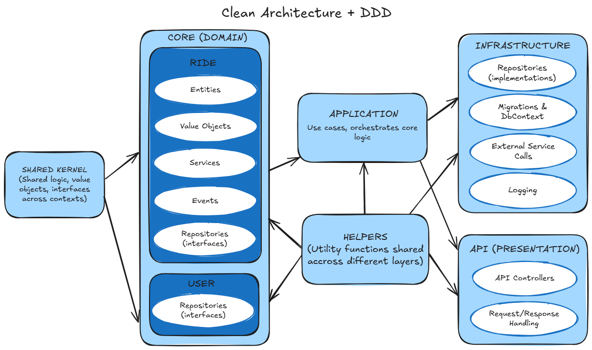

# Domain Driven Design (DDD) Architecture
**Domain-Driven Design (DDD)** is a concept introduced by programmer Eric Evans in 2004 in his book **_Domain-Driven Design: Tackling Complexity in the Heart of Software_**.

**Domain-Driven Design (DDD)** is a software development philosophy that emphasizes the importance of understanding and modeling the business domain.

- DDD is a strategy aimed at **improving the quality of software** by aligning it more closely with the **business needs** it serves.
- DDD highlights the need for **close collaboration with domain experts** to gain a thorough understanding of the domain's details and complexities.
- DDD offers principles, patterns, and practices to help developers **accurately capture and represent domain concepts** in their software designs.
- We can separate two design pattern types in DDD: **Strategic Design** and **Tactical Design**.

## Strategic Design in Domain-Driven Design(DDD)
**Strategic Design in Domain-Driven Design (DDD)** focuses on defining the overall architecture and structure of a software system in a way that **aligns with the problem domain**. It addresses high-level concerns such as how to organize domain concepts, how to partition the system into manageable parts, and how to establish clear boundaries between different components.

Let's check some key concepts within **Strategic Design in Domain-Driven Design(DDD)**:

### Domain and Subdomains:
#### Domain
In **Domain-Driven Design (DDD)**, the **domain** refers to the specific business area or problem space that the software is designed to address.  
For instance, in a banking application, the **domain** involves concepts like **accounts**, **transactions**, **customers**, and relevant **banking regulations**.

#### Subdomains
The term **domain** refers to the broad and often abstract area of knowledge or activity that a software system is designed to address. To make it more concrete and manageable, it is useful to divide it into smaller, focused areas known as **subdomains**.

Before identifying specific subdomains, it's important to understand their classification. In Domain-Driven Design (DDD), all subdomains are typically categorized into three types:

- **Core Domain**  
  A core domain is what makes an organization unique and sets it apart from others. An organization cannot succeed or even operate without being exceptionally strong in its core domain.
- **Supporting Subdomain**  
  A supporting subdomain is necessary for the organization to succeed, but it does not fall into the core domain category.
- **Generic Subdomain**  
  A generic subdomain does not contain anything specific to the organization but is still needed for the overall solution to function. You can often save significant time and effort by using off-the-shelf software for these areas.  
  A typical example would be **user identity management**.

### Bounded Contexts
A specific area within a problem domain where a particular model or language is consistently used.
- Breaks down large, complex domains into smaller, more manageable parts.
- There is not necessarily a one-to-one mapping between bounded contexts and subdomains - a single subdomain can contain multiple bounded contexts.

### The Ubiquitous Language
A shared, consistent vocabulary used by all team members - developers, domain experts, and stakeholders to communicate about the domain.
- It is applied throughout software development to accurately capture relevant domain knowledge.
- The main goal is to establish a **common understanding among team members**, enabling clearer communication about domain concepts and requirements.
- The language mirrors the terminology used in the business context, ensuring the software reflects real-world processes accurately.

### Context Mapping
The process of defining relationships and interactions between different **Bounded Contexts**.
- Establishes clear communication and agreements between different contexts.
- Ensures different parts of the system can work together effectively while maintaining boundaries.
- Boundaries between bounding contexts help teams to collaborate effectively while maintaining common codebase.
- Mapping can reveal different types of relationships, such as:
  - **Partnership**: two teams integrate their software systems closely, treating them as one combined system and sharing the model code across team boundaries. This mapping style is suitable when the teams have a trustful relationship and a substantial overlap in their domain models.
  - **Shared Kernel**: involves multiple teams sharing a subset of the domain model, which is treated as a shared kernel, while each team maintains its own context and model for the rest of their respective domains.
  - **Customer-Supplier:** one team (the supplier) develops a software system that is consumed by another team (the customer), with a clear upstream-downstream relationship between the two teams.
  - **Conformist:** one team (the conformist) adheres to a model defined by another team, essentially treating the other team’s model as the central, canonical model.
  - **Anti-Corruption Layer (ACL):** involves creating a translation layer between two different models, allowing them to communicate without tight coupling, while also protecting a bounded context from external changes by shielding it through model translation.
  - **Open Host Service:** one team (the host) provides a service that can be extended by other teams through plugins or adapters, enabling a centralized system with extensibility points.
  - **Published Language:** involves one team (the publisher) defining and publishing a language or protocol that other teams use to integrate with the publisher’s system, without sharing the internal model.
  - **Separate Ways:** teams work on completely separate systems with no integration or shared model, essentially ignoring the existence of other systems and teams.

## Tactical Design Patterns in Domain-Driven Design (DDD)

In Domain-Driven Design (DDD), **tactical design patterns** are specific strategies or techniques used to **structure and organize the domain model within a software system**. These patterns help developers effectively capture the complexity of the domain, while also promoting maintainability, flexibility, and scalability.   
Let us see some of the key tactical design patterns in DDD:

### 1. Entity
An **entity** is a domain object that has a distinct identity and lifecycle. 
- Entities are characterized by their unique identifiers and mutable state. 
- They encapsulate behavior and data related to a specific concept within the domain.

**For example**, in a banking application, a `BankAccount` entity might have properties like `account number`, `balance`, and `owner`, along with methods to `deposit`, `withdraw`, or `transfer funds`.

### 2. Value Object
A **value object** is a type of domain object that represents a value that is conceptually unchangeable. 
- Unlike entities, value objects lack a unique identity and are usually used to describe **attributes or characteristics of entities**. 
- They are compared for equality based on their properties rather than their identity.

**For example**, a `Money` value object might represent a specific `amount of currency`, encapsulating properties like `currency type` and `amount`.

### 3. Aggregate
An **aggregate** is a cluster of domain objects that are treated as a single unit for the purpose of data consistency.
- Aggregates consist of **one or more entities and value objects**, with one entity designated as the aggregate root.
- Aggregates enforce consistency boundaries within the domain model, ensuring that changes to related objects are made atomically.

**For example**, in an e-commerce system, an `Order` aggregate might consist of entities like `OrderItem` and `Customer`, with the `Order` entity serving as the aggregate root.

### 4. Repository
**Repositories** separate data access logic from the domain model.
- Repositories provide a consistent interface for **querying and storing domain objects**.
- Repositories hide the specifics of how data is retrieved or stored.
- They encapsulate the translation between domain objects and underlying data storage methods, such as **databases** or **external services**.
- Typically, repository interfaces are stored on domain model while repository implementations are stored on infrastructure layer.

**For example**, a `CustomerRepository` might provide methods for querying and storing `Customer` entities.

### 5. Factory
A **factory** is a creational pattern used to encapsulate the logic for creating instances of complex domain objects.
- Factories abstract the process of object instantiation, allowing clients to create objects without needing to know the details of their construction.

**For example**, a `ProductFactory` might be responsible for creating instances of `Product` entities with default configurations.

### 6. Service
A **service** is a domain object that represents a behavior or operation that does not naturally belong to any specific entity or value object.
- Services encapsulate domain logic that operates on multiple objects or orchestrates interactions between objects.
- Services are typically stateless and focus on performing specific tasks or enforcing domain rules.
   
**For example**, an `OrderService` might provide methods for `processing orders`, `applying discounts`, and `calculating shipping costs`.

## Benefits of Domain-Driven Design(DDD)
- **Improved Domain Understanding:**       
DDD emphasizes a **deep understanding of the business domain**, leading to software that more accurately reflects real-world processes and requirements.
- **Enhanced Communication:**    
The use of a "ubiquitous language" (a shared vocabulary between developers and domain experts) **improves communication and collaboration**.
- **Increased Maintainability:**    
DDD's focus on clear domain models and well-defined boundaries makes code **easier to understand, modify, and extend**.
- **Greater Flexibility and Scalability:**    
DDD facilitates **adapting to changes** in business requirements and **scaling** specific parts of the system as needed without affecting the entire application.
- **High-Quality Design:**    
DDD promotes a thoughtful and well-structured design that accurately reflects business processes, resulting in more **robust and maintainable software**.


## Challenges of Domain-Driven Design (DDD)
- **Steep Learning Curve**    
Mastering DDD's concepts and patterns requires a **significant investment in time and effort**.
- **Increased Initial Effort**    
The initial phase of a DDD project, involving domain exploration and ubiquitous language development, can be **time-consuming** and lead to **longer initial development times**.
- **Complexity in Large Domains**    
In large and complex domains, creating a cohesive domain model and maintaining consistency across bounded contexts can be **challenging**.
- **Need for Strong Domain Expertise**    
  DDD relies on close collaboration between developers and **domain experts**. **Limited access to domain experts** or **ineffective communication** can significantly **reduce the success and applicability of DDD**.
- **Potential Overhead**    
For simple applications, DDD's **complexity might outweigh its benefits**, and the overhead of implementing DDD might not be worthwhile.

## When to choose DDD?

### Domain-Driven Design and Business Focus
**Domain-Driven Design (DDD)** is an approach that centers around a deep understanding of the **business domain** and the **product** itself. The primary goal is to ensure that technical solutions align closely with business needs and make sense within the problem space being addressed.
- In DDD, iteration is driven by the evolving understanding of the domain - not by the underlying technology. The value lies in **modeling the real-world processes accurately**, rather than focusing on specific frameworks, programming languages, or technical preferences.
- Successful adoption of DDD requires close collaboration with **domain experts** and active involvement from the **business side**. Without this, the architecture risks being disconnected from its intended purpose.
- It’s important to note: **DDD is not a purely technical exercise**. Approaching it only from a technical perspective, without prioritizing domain understanding, goes against the core philosophy of DDD.

### When to Consider DDD:
- **Complex Business Logic**    
If your application has intricate business rules, numerous edge cases, and evolving requirements, DDD can help manage this complexity and create a more robust and maintainable system.
- **Large-scale applications**  
For applications with multiple teams working on different parts of the system, DDD can help establish clear boundaries, promote communication, and ensure consistent understanding across teams.
- **Strong Business-development Alignment**  
DDD emphasizes close collaboration between developers and domain experts, fostering a shared understanding of the business domain and aligning the software with business goals.
- **Evolving Requirements**    
If your application is likely to change and evolve over time, DDD can help you build a more flexible and adaptable system that can accommodate these changes more easily.
- **New and Unknown Domains**    
If you're working with a domain that is new to you and your team, DDD can help you explore and understand the domain, identify key concepts, and build a system that accurately reflects the business logic.

### When DDD might not be the Best Choice:
- **Simple Applications**    
If your application has very simple `CRUD` (`Create`, `Read`, `Update`,`Delete`) operations and minimal business logic, DDD might introduce unnecessary complexity and overhead.
- **Small Projects**      
For small projects with limited complexity and a short development cycle, the benefits of DDD might not outweigh the effort required to implement it.
- **Focus on Data**    
If your application is primarily data-driven and performance is the top priority, data-driven design might be a more suitable approach.

## Real-world Example of Domain-Driven Design (DDD) + Clean Architecture

### Concept Mapping
Let's understand the real-world example of Domain-Driven Design through a problem statement below:

Assume, we are developing a ride-hailing application called **"RideX."** The system allows users to request rides, drivers to accept ride requests, and facilitates the coordination of rides between users and drivers.

1. **Ubiquitous Language**
   - **User:** Individuals who request rides through the RideX platform.
   - **Driver:** Individuals who provide rides to users on the RideX platform.
   - **Ride Request:** A user’s request for a ride, detailing the pickup location, destination, and ride preferences.
   - **Ride:** A specific instance of a ride that includes pickup and drop-off locations, fare, and duration.
   - **Ride Status:** Indicates the current state of a ride, such as `Requested`, `Accepted`, `In Progress`, or `Completed.`
2. **Bounded Contexts**
   - **Ride Lifecycle Management**: includes **ride requests**, **driver assignment**, and **ride status updates**.
   - **User Management**: covers **authentication**, **registration**, **ride history**, and **payment methods**.
   - **Driver Management**: includes **authentication**, **registration**, **availability**, **earnings**, and **ratings**.
3. **Entities and Value Objects**
   - **User Entity:** Represents a registered user on the RideX platform, with properties like `userId`, `email`, `password`, and `paymentInformation`.
   - **Driver Entity:** Represents a registered driver, including properties such as `driverId`, `vehicleDetails`, and `driverStatus`.
   - **RideRequest Entity:** Represents a user’s ride request, including properties like `requestId`, `pickupLocation`, `destination`, and `ridePreferences`.
   - **Ride Entity:** Represents an instance of a ride, detailing `rideId`, `pickupLocation`, `dropOffLocation`, `fare`, and `rideStatus`.
   - **Location Value Object:** Represents a geographical location with properties for `latitude` and `longitude`.
4. **Aggregates**
   - **Ride Aggregate:** The central component is the `Ride` entity, along with related entities like `Ride Request`, `User`, and `Driver`. This aggregate **manages the lifecycle of a ride**, including **processing ride requests**, **assigning drivers**, and **updating ride statuses**.
5. **Repository**
   - **Ride Repository:** Provides methods for querying and storing ride-related entities, including retrieving ride details, updating ride statuses, and saving ride data in the database.
6. **Services**
   - **Ride Assignment Service:** Responsible for assigning available drivers to ride requests, considering factors like driver availability, proximity to the pickup location, and user preferences.
   - **Payment Service:** Manages payment processing for completed rides, calculating fares, handling payments, and updating payment information for users and drivers.
7. **Domain Events**
   - **RideRequestedEvent:** Triggered when a user requests a ride, containing details about the `ride request` and the `user ID`.
   - **RideAcceptedEvent:** Triggered when a driver accepts a ride request, including information like the `ride ID`, `driver ID`, and `pickup location`.
8. **Example Scenario**
   - **User Requesting a Ride:** A user inputs their pickup location, destination, and preferences. RideX creates a new ride request entity and triggers a `RideRequestedEvent`.
   - **Driver Accepting a Ride:** A driver accepts the ride request on the RideX platform. The ride status changes to `Accepted`, the driver is assigned, and a `RideAcceptedEvent` is triggered.
   - **Ride In Progress:** Once the driver arrives at the pickup location, the ride status updates from `Accepted` to `In Progress`.
   - **Ride Completion:** After reaching the destination, the ride status is updated to `Completed`. RideX calculates the fare, processes payment, and updates the payment information for both the user and the driver.

### File Structure: DDD + Clean Architecture

```
src/
├── core/                      # Domain Layer: business rules, domain models, aggregates
│   ├── ride/                  
│   │   ├── entities/
│   │   ├── value-objects/
│   │   ├── services/
│   │   ├── events/
│   │   ├── repositories/         # Ride-related domain repositories (interfaces)
│   │   └── ride.aggregate.ts
│   └── user/                  
│       ├── entities/
│       ├── value-objects/
│       ├── services/
│       ├── events/
│       ├── repositories/         # User-related domain repositories (interfaces)
│       └── user.aggregate.ts
│
├── application/              # Application Layer: use cases, orchestrates core logic
│   ├── ride/
│   │   └── create-ride.use-case.ts
│   └── user/
│       └── register-user.use-case.ts
│
├── api/                      # Presentation Layer: controllers, routes, resolvers, DTOs
│   ├── ride/
│   │   └── ride.controller.ts
│   └── user/
│       └── user.controller.ts
│
├── infrastructure/           # Infrastructure Layer: databases, external APIs, services
│   ├── db/
│   │   ├── ride/
│   │   │   └── ride.repository.impl.ts   # Implements RideRepository interface
│   │   └── user/
│   │       └── user.repository.impl.ts   # Implements UserRepository interface
│   ├── logger/
│   └── payment/
│
├── shared-kernel/            # Shared logic, value objects, interfaces across contexts
│   ├── location.ts
│   ├── user-id.ts
│   └── interfaces/
│       └── logger.interface.ts
│
├── helpers/                  # Utility functions
│   ├── date-utils.ts
│   └── validator.ts
│
└── index.ts                  # Application entry point
```

### Diagram: DDD + Clean Architecture


## Documentation and References
### General
- Book [Domain-Driven Design: Tackling Complexity in Heart of Software](https://books.google.am/books?id=hHBf4YxMnWMC&printsec=copyright&redir_esc=y#v=onepage&q&f=false) by Eric Evans
- [Domain-Driven Design (DDD)](https://www.geeksforgeeks.org/system-design/domain-driven-design-ddd/) by geeksforgeeks.org
- [Domain-Driven Design (DDD)](https://redis.io/glossary/domain-driven-design-ddd/) by redis.io
- [DDD Part 1: Strategic Domain-Driven Design](https://vaadin.com/blog/ddd-part-1-strategic-domain-driven-design) by [Petter Holmström](https://github.com/peholmst)
- [DDD Part 2: Tactical Domain-Driven Design](https://vaadin.com/blog/ddd-part-2-tactical-domain-driven-design) by [Petter Holmström](https://github.com/peholmst)
- [What is Domain Driven Design?](https://www.port.io/glossary/domain-driven-design) by port.io
- [Domain-Driven Design (DDD): Strategic Design Explained](https://medium.com/@lambrych/domain-driven-design-ddd-strategic-design-explained-55e10b7ecc0f) by [Jakub Lambrych](https://www.linkedin.com/in/jakub-lambrych/)
- [Strategic Domain Driven Design with Context Mapping](https://www.infoq.com/articles/ddd-contextmapping/)

### DDD in Front-end
- [The Guiding Theory: Strategic Design from DDD](https://www.angulararchitects.io/en/blog/modern-architectures-with-angular-part-1-strategic-design-with-sheriff-and-standalone-components/) by [Manfred Steyer](https://www.linkedin.com/in/manfred-steyer-84645821/)
- [You're misunderstanding DDD in Angular (and Frontend)](https://www.angularspace.com/youre-misunderstanding-ddd-in-angular-and-frontend/) by [Tomasz Ducin](https://www.linkedin.com/in/tomasz-ducin-82234a4b/)

### DDD in Back-end
- [Design a DDD-oriented microservice](https://learn.microsoft.com/en-us/dotnet/architecture/microservices/microservice-ddd-cqrs-patterns/ddd-oriented-microservice)

### Other References
- [Clean Architecture](./clean-architecture.md)