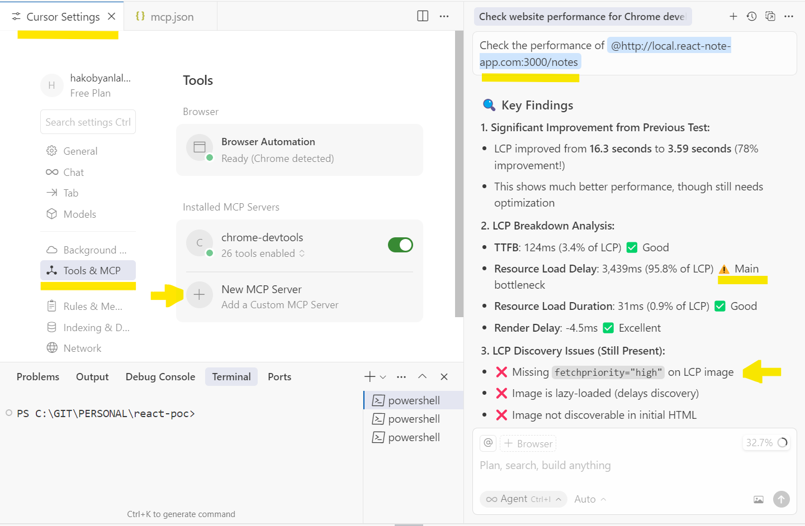

# Chrome DevTools MCP Server
Chrome DevTools MCP Server lets your coding agent (such as Gemini, Claude, Cursor or Copilot) control and inspect a live Chrome browser. It gives your AI coding assistant access to the full power of Chrome DevTools for reliable automation, in-depth debugging, and performance analysis.

## How to install?
### Install Chrome DevTools MCP Server in Cursor IDE
Below are steps to install Chrome Dev Tools MCP Server in Cursor IDE:
1. Go to **File -> Preferences -> Cursor Settings**
2. Choose **Tools & MCP -> New MCP server**
   It would open the `mcp.json` file where you can add your MCP server config:
```json
{
    "mcpServers": {
        "chrome-devtools": {
            "command": "npx",
                "args": ["-y", "chrome-devtools-mcp@latest"]
        }
    }
}
```
3. After that, you can start sending MCP related prompt to your MCP client.
   For example, writing the following prompt in Cursor IDE MCP client chat:  
   `Check the performance of https://developers.chrome.com`
4. In the process when prompt is firstly executed, make sure to add `chrome-dev-tools` commands to **Allowlist** so that each time it doesn't ask permission to run the specific operation.
5. Once the analysis is complete, a full report will be displayed with actionable suggestions for improvement.



## Key Features
- **Get performance insights:** Uses Chrome DevTools to record traces and extract actionable performance insights.
- **Advanced browser debugging:** Analyze network requests, take screenshots and check the browser console.
- **Reliable automation:** Uses [puppeteer](https://github.com/puppeteer/puppeteer) to automate actions in Chrome and automatically wait for action results.

## Configuration Options
The Chrome DevTools MCP server supports the following configuration options:

-   `--browserUrl`, `-u`: Connect to a running Chrome instance using port forwarding.   
    For more details see: https://developer.chrome.com/docs/devtools/remote-debugging/local-server.
    - **Type:** `string`   

-   `--headless`: Whether to run in headless (no UI) mode.
    - **Type:** `boolean`
    - **Default:** `false`

-   `--executablePath`, `-e`: Path to a custom Chrome executable.
    - **Type:** `string`

-   `--isolated`: If specified, creates a temporary user-data-dir that is automatically cleaned up after the browser is closed.
    - **Type:** `boolean`
    - **Default:** `false`

-   `--channel`: Specify a different Chrome channel that should be used. The default is the stable channel version.
    - **Type:** `string`
    - **Choices:** `stable`, `canary`, `beta`, `dev`

-   `--logFile`: Path to a file to write debug logs to. Set the env variable `DEBUG` to `*` to enable verbose logs. Useful for submitting bug reports.
    - **Type:** `string`

-   `--viewport`: Initial viewport size for the Chrome instances started by the server. For example, `1280x720`. In headless mode, the max size is 3840x2160px.
    - **Type:** `string`

-   `--proxyServer`: Proxy server configuration for Chrome passed as `--proxy-server` when launching the browser.   
    See https://www.chromium.org/developers/design-documents/network-settings/ for details.
    - **Type:** `string`

-   `--acceptInsecureCerts`: If enabled, ignores errors relative to self-signed and expired certificates. Use with caution.
    - **Type:** `boolean`

-   `--chromeArg`: Additional arguments for Chrome. Only applies when Chrome is launched by chrome-devtools-mcp.
    - **Type:** `array`

Pass them via the `args` property in the JSON configuration. For example:
```json
{
  "mcpServers": {
    "chrome-devtools": {
      "command": "npx",
      "args": [
        "chrome-devtools-mcp@latest",
        "--channel=canary",
        "--headless=true",
        "--isolated=true"
      ]
    }
  }
}
```

You can also run `npx chrome-devtools-mcp@latest --help` to see all available configuration options.

## Use Cases
Below are only few from all the use cases that Chrome Devtools MCP servers enables for engineers:

**1. Instant End-to-End (E2E) Testing from Your IDE & in CI/CD**  
You can instantly create and run E2E tests without setting up complex frameworks like **Playwright, Cypress, or Selenium**. Since the Chrome Devtools MCP server has **Puppeteer** built-in, your AI assistant can translate your plain English commands into a reliable browser automation script.   
This is perfect for quick validation during development in your IDE or for running checks in a CI/CD pipeline before deployment.
- **How it works in your IDE:** You give a natural language prompt directly in your IDE's chat. The AI uses the MCP server to control a browser, execute the steps, and report back the results.
- **How it works in CI/CD:** When a developer opens a pull request, a service like **GitHub Actions** can automatically run these AI-generated test scripts. The script launches a **headless Chrome browser** on the server, performs the validation steps, and if a test fails (e.g., a button isn't found or a success message doesn't appear), the pipeline fails. This acts as an automated **quality gate**, blocking buggy code from being merged.

**2. Autonomous Real-Time Production Monitoring**  
This is a standalone AI application that acts as a **synthetic user**, continuously checking the health of your **live production application**. Instead of waiting for users to report an issue, this AI agent proactively finds problems.
* **How it works:** A scheduled service (e.g., running every 15 minutes) uses the Chrome Devtools MCP server to navigate through critical user flows on your live site (like login, searching, and checkout). It collects logs, network requests, and performance metrics. The data is then fed to an AI model to generate reports and suggest action items.
* **Example AI Alert (posted to Slack):**
  > **Critical Alert:** The checkout flow is broken. The `/api/payment` endpoint has returned a `502 Bad Gateway` error for the last 3 consecutive checks. The page is showing a generic 'Something went wrong' message to users. Paging the on-call engineer.

**3. Automated Bug Reproduction and Root Cause Analysis**
This is an incredibly powerful workflow for developers. When a bug is reported, you can ask your AI assistant to reproduce it. It will perform the steps in the browser using Chrome Devtools MCP, gather all the critical context (console errors, failed network requests, screenshots), and then use its knowledge of your codebase to pinpoint the exact problem and suggest a fix.
- **Example Prompt:**
  > "There's a bug where the user profile page crashes if the user has no avatar. Please navigate to a user profile without an avatar, capture the console error and the failed API response, and then show me the exact line in `ProfileComponent.tsx` that is causing the crash."

**4. On-Demand Accessibility and SEO Audits**
You can ask your AI assistant to perform a comprehensive audit directly from your IDE. The Chrome Devtools MCP server can programmatically run Google's **Lighthouse** tool, and the AI can then translate the generic report into concrete code suggestions tailored to your components.
- **Example Prompt:**
  > "Run a Lighthouse accessibility audit on the product details page. List all images missing `alt` text and suggest descriptive text for them based on the component's props. Also, check for any color contrast issues."

### Example: AI-Assisted E2e Test Case POC with Report Generation
Below is a Proof-of-Concept (POC) example of a test case written in plain language for the Cursor IDE's AI assistant. With zero code, the assistant can automatically perform the test and generate a report.

The main steps it performs are:
- Navigates to the given URL (opening a Google Chrome browser).
- Finds the specified note element.
- Clicks its edit icon to open the modal.
- Edits the title.
- Saves the changes.
- Validates that the changes were saved correctly.
- Collects console logs and network requests throughout the process and generates a final report.

After experimenting different AI models in **Cursor IDE** and trying latest version of **Chrome Dev Tools MCP**, I found out that it works best with `claude-4.5-sonnet` model and this simplified prompt:   

```text
Open @http://local.react-note-app.com:3000/notes

Here are the Important Rules that you need to follow:
- Execute exactly the listed actions. Do not click any other element than the one specified.
- Use the exact selectors below. If a selector returns 0 or more than 1 element, stop and return an error with a 300-char DOM excerpt.
- Wait for network idle before the first action, and for the UI to be stable (no layout/size changes) for 50 ms before each click or type.
- ALWAYS use Chrome DevTools commands (mcp_chrome-devtools_*) instead of JavaScript evaluation for ALL browser interactions (query, click, fill, etc.).

Step 1 - Open and start capturing:
- Wait for network idle.
- Begin capturing console logs (fields: ts, level, text, url, line, column) and network request/response information.
- Generate a timestamp in format `DD-MM-YYYY-HH-mm` (e.g. `15-10-2025-00-12`) and store it as `RUN_DATE`.

Step 2 - Click ONLY the edit icon for the target note:
- Resolve a SINGLE node via selector '[data-id="54"] .svg-link:first-child'
- Do not take snapshots to verify, do not try to find the element again, do not question the UID.
- Click immediately the found node ONCE. Do not click any other elements with class "svg-link".

Step 3 - Wait for modal and edit the title:
- Wait ONLY for 50ms until a dialog is present with this selector: '#modal'
- Within the dialog, locate the title input using the first that exists with this selector: 'input[name="title"]'
- Ensure the input is interactable and stable for 50 ms.
- Focus the input, select all (Ctrl/Cmd + A), delete, then type EXACTLY: DIY Cat Toys Test1.

Step 4 - Save and close:
- Locate the save button inside the dialog using the first that exists with this selector: 'button[name="submitButton"]'
- Ensure the button is visible and stable for 50 ms, then click it ONCE.
- Wait until the dialog disappears (the dialog selectors from Step 3 should not exist).

Step 5 - Verify the update:
- On the list view, confirm that the element with the '[data-id="54"] h3' now contains  text "DIY Cat Toys Test1".
- If not, return failure with a 300-char DOM excerpt around [data-id="54"].

Step 6 - Summarize console and write report:
- Group captured console logs into Errors, Warnings, Info (info + debug).
- Group request and response information of the API requests.
- Redact secrets using patterns: `["apiKey=\\S+", "Authorization: Bearer \\S+", "token=\\S+"]`
- Provide counts per group and up to 2 example lines per group (after redaction).
- Create Markdown at path: `apps/note-app-nextjs/e2e/report-${RUN_DATE}.md`
  Use this EXACT template:

# Note Edit E2E Report — ${RUN_DATE}
- **Date:** ${RUN_DATE}
- **URL:** http://local.react-note-app.com:3000/notes
- **Edited Note ID:** 54
- **Old Title:** DIY Cat Toys
- **New Title:** DIY Cat Toys Test1
- **Result:** {Success | Failed + short reason}

## Console Summary
| Type    | Count | Examples |
|---------|-------|----------|
| Errors  | {E}   | {up to 2 redacted examples} |
| Warnings| {W}   | {up to 2 redacted examples} |
| Info   | {I}   | {up to 2 redacted examples} |

## Observations
- {1–3 concise bullets on issues/patterns}

## Suggested Fixes
- [ ] {short, actionable suggestion}
- [ ] {optional second suggestion}

- Verify the file exists and is > 200 bytes, then return a final JSON object:
  { "status": "ok" | "failed", "noteId": "54", "newTitle": "DIY Cat Toys Test1",
   "reportPath": "apps/note-app-nextjs/e2e/report-${RUN_DATE}.md",
   "counts": { "errors": E, "warnings": W, "info": I } }
```

**Important Notes: Challenges / Downsides**   
- This prompt was tested in the Cursor IDE, and the `Rules` section proved to be critical for ensuring the AI assistant executed the test correctly.   
Specifically, without the instruction to `ALWAYS DO - Use Chrome DevTools commands (mcp_chrome-devtools_*)`, the AI assistant would fall back to using direct JavaScript commands to modify data. This resulted in non-realistic interactions because it bypassed the actual user event simulation that the Chrome DevTools MCP commands provide.
- The AI assistant wasn't always stable and sometimes ignored rules in [the initial prompt](../_assets/files/chrome-devtools-mcp-prompt-e2e-poc) I created (e.g., not obeying the given delay while it waits for the modal).  
However, with the latest updates to **Chrome DevTools**, I was able to come up with [a more simplified version of the initial prompt](../_assets/files/chrome-devtools-mcp-prompt-e2e-poc-simplified), which performs much more stable.   
Using the dedicated `claude-4.5-sonnet` model also gave me the best experience among all the models I tested.

**Resources**
- You can download the simplified prompt from [here](../_assets/files/chrome-devtools-mcp-prompt-e2e-poc-simplified).
- You can also check out the [video on my LinkedIn post](https://www.linkedin.com/posts/lala-hakobyan_chromedevtools-mcp-testautomation-activity-7384583911139627008-_jYV?utm_source=share&utm_medium=member_desktop&rcm=ACoAABkSvQYBpJNmZiZXBqeqZcp_G7Mxj20Pglw) to see how a full end-to-end test is generated from a single prompt in my local React/Next.js POC project.

## Security Considerations
Chrome DevTools MCP is a **trusted integration from Google**. However, because DevTools MCP can see everything in an open browser tab, caution is required when your AI client also connects to **other MCP servers** (e.g., file system, HTTP fetch, cloud tools) in the same session, as sensitive data can move between tools if not controlled.

It is still advisable to follow [general MCP security measures (auth, TLS, least privilege)](mcp-servers-ai.md). Below are some security risks related to **Chrome DevTools MCP server** integration that you should be aware of.

**1. Cross-Server Data Leak (DevTools MCP → another MCP server)**  
**Risk:** If your AI application connects to **DevTools MCP** **and** also to another **untrusted/malicious MCP server**, the AI agent could **unintentionally forward** sensitive tab data (tokens, cookies, PII, console/network content) to that other server during tool use.

**Safety Actions:**  
- Enable **only trusted MCP servers** in the AI client for that job. Disable everything else.
- Enforce a **tool allowlist** for the job: DevTools MCP is allowed; external/egress tools are **blocked**.

**2. Access to Sensitive and Personal Data**  
**Risk:** In the open Chrome browser tab, Chrome DevTools MCP can read the DOM, console, network traffic (including bodies, if allowed), and take screenshots. Assume the AI agent “sees” everything DevTools sees. This poses **a significant risk if you are logged into a personal or production-sensitive account** in the browser tab accessed by the Chrome DevTools MCP server, as you could **unintentionally expose important information to the AI model**.

**Safety Actions:**  
In the browser window controlled by the Chrome DevTools MCP server:
- Do **not** use personal accounts or real production dashboards.
- Use **sandbox/test accounts** and **masked data fixtures** only.
- Use a **temporary Chrome profile** for running the tests. You can use the `--isolated` flag to achieve this: `chrome-devtools-mcp@latest --isolated`. This flag launches Chrome with a temporary, isolated user profile that is automatically deleted when the session ends, leaving no data behind.
- Ensure the browser tab is closed (automatically or manually) after the session is finished to prevent accidental personal use later.

**3. Saved Artifacts (Traces, HAR, Console Logs) May Contain Secrets**   
**Risk:** Traces, HAR files, and console logs that Chrome DevTools can access often include `Authorization` headers, cookies, tokens, emails/IDs, or full payloads. If the AI writes these logs and traces to physical files, there is a risk of exposing sensitive data in your version control system or to unintended parties.

**Safety Actions:**  
- **Implement a pre-processing step:** Before any AI processing or uploads, automatically redact sensitive patterns (e.g., `Authorization: Bearer *`, `apiKey=*`, `token=*`, `Set-Cookie`, emails, IDs).
- Prefer **excluding response bodies** in HAR files by default. If they are needed, **truncate** and **hash** large bodies.
- Store artifacts (logs, traces, HAR files, reports) **only in a private, temporary storage location** used by your CI/CD system. Do not keep them permanently-set them to be deleted automatically after a short time.
- When sharing results (for example, in a pull request), include **only summaries or high-level reports**. If someone needs the full files, share a **secure link** that requires authorization to access them.

> **Note:** A **HAR file (HTTP Archive)** records all browser network activity—every request, response, header, and sometimes even the response body. Because it can contain sensitive data such as API keys, cookies, or user information, always treat HAR files as confidential.


## Documentation and Resources
- [Chrome Dev Tools MCP](https://github.com/mcp/chromedevtools/chrome-devtools-mcp)
- [Chrome Dev Tools MCP GitHub repo](https://github.com/ChromeDevTools/chrome-devtools-mcp)
