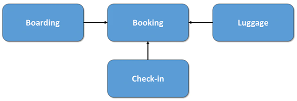
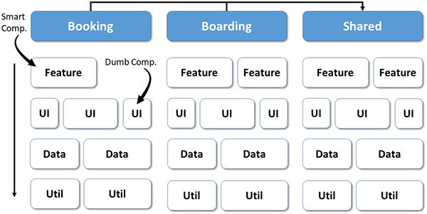
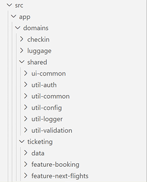

# Angular Architecture: Modern Angular 2025 (v20)

## Table of Contents
- [Best Practices for Building Scalable, Maintainable and Testable Angular Code](#best-practices-for-building-scalable-maintainable-and-testable-angular-code)
- [Angular Build Tools](#angular-build-tools)
- [Project Structure, Naming Conventions and Best Practices](#project-structure-naming-conventions-and-best-practices)
- [Design Patterns](#design-patterns)
- [Angular Architecture Types](#angular-architecture-types)
- [State Management](#state-management)
- [Form Manipulation](#form-manipulation)
- [Data Fetching and API Manipulation](#data-fetching-and-api-manipulation)
- [Server and Hybrid Rendering](#server-and-hybrid-rendering)
- [Styling](#styling)
- [Linting](#linting)
- [Unit Testing](#unit-testing)
- [Localization & Translation](#localization--translation)
- [Theming](#theming)
- [High Quality Project References](#high-quality-project-references)
- [Documentation and References](#documentation-and-references)

## Best Practices for Building Scalable, Maintainable and Testable Angular Code
- Use **consistent and meaningful folder structure** (e.g., feature-based or domain-driven) and follow [**Angular coding style guide**](https://angular.dev/style-guide#when-in-doubt-prefer-consistency) for building maintainable and scalable Angular applications. 
- Adopt `Container-Presentation` or `Strategic Design from DDD` architectural patterns in order to create scalable angular applications.
- **Improve rendering performance** by using `OnPush` change detection strategy.
- **Always unsubscribe from observables** in components to prevent memory leaks - typically done in `ngOnDestroy()` using `takeUntil`, `Subscription`, or signal-based approaches.
- Use **lazy loading** of features and resources(images, videos, etc.) to achieve better performance.
- For small projects, prefer using custom state management built with `signals` or `RxJS`, rather than introducing external store libraries. For larger projects, it's recommended to use a **Redux-style store** or other scalable state libraries.
- Use `signals` for synchronous data manipulation, like component local state. And use `RxJS` for asynchronous operations like API manipulations.
- Include **unit and component testing** to ensure reliability and catch regressions early.
- **Avoid prop drilling** - use custom state or state management libraries (e.g. `ngrx`) when passing props through more than two levels.
- Integrate **linting plugins** to enforce [Angular coding style]((https://angular.dev/style-guide#when-in-doubt-prefer-consistency)), accessibility rules and consistent code style.
- **Choose the right approach** for state management, API handling, styling, and forms based on project needs.
- Follow [**Clean Code Principles**](./../../architecture/clean-code-principles.md) and [SOLID Principles](./../../architecture/solid-principles.md) to improve maintainability and scalability.
- Consider general [**front-end security attacks**](https://www.geeksforgeeks.org/blogs/top-common-frontend-security-attacks/) and [**performance best practices**](https://www.geeksforgeeks.org/blogs/best-practices-for-enhancing-application-performance/) when building Angular applications.

This documentation contains summaries and trade-offs of various tools and architectural patterns for Angular applications, based on **personal experience**, **community best practices**  and **official documentation**.   
You can check the [Frontend Architecture Overview](../frontend-architecture/architecture-overview-frontend) document to dive deep into core architectural concepts and the decision-making process behind choosing them.

## Angular Build Tools

### [The Angular CLI](https://angular.dev/tools/cli)
- **The Angular CLI** is a command-line interface tool which allows you to scaffold, develop, test, deploy, and maintain Angular applications directly from a command shell.
- **Angular CLI** is published on `npm` as the `@angular/cli` package and includes a binary named `ng`. Commands invoking `ng` are using the **Angular CLI**.
- In order to install specific Angular version globally, use the following command:  
`npm install -g @angular/cli@18`
- In order to install latest Angular version globally, use the following command:  
`npm install -g @angular/cli`
- Then you can go to specific folder and install different version of Angular in that folder:  
`cd angular-17-project`   
`npm install @angular/cli@17`

### Project and Generation Commands
| 💡 Purpose                   | 🛠️ CLI Command                                                           |
| ---------------------------- | ------------------------------------------------------------------------- |
| **Create new Angular app**   | `ng new my-app [--standalone]`                                            |
| **Run dev server**           | `ng serve`                                                                |
| **Build the app**            | `ng build`                                                                |
| **Generate Angular library** | `ng generate library my-lib`<br>`ng g lib my-lib`                         |
| **Generate component**       | `ng generate component foo [--standalone]`<br>`ng g c foo [--standalone]` |
| **Generate service**         | `ng generate service foo`<br>`ng g s foo`                                 |
| **Generate directive**       | `ng generate directive foo`<br>`ng g d foo`                               |
| **Generate pipe**            | `ng generate pipe foo`<br>`ng g p foo`                                    |
| **Generate guard**           | `ng generate guard foo`<br>`ng g g foo`                                   |
| **Run unit tests**           | `ng test`                                                                 |
| **Run linting**              | `ng lint`                                                                 |
| **Run end-to-end tests**     | `ng e2e` (if configured)                                                  |


## Project Structure, Naming Conventions and Best Practices
### Standalone Folder Structure
**Standalone components** in Angular are components that can operate independently without being part of an `NgModule`. Introduced to simplify the development process, they promote a more modular and flexible architecture. 
- A standalone component is self-contained - it declares its own dependencies and configuration directly, without relying on external modules.
- Previously, dependencies were declared in shared modules, and importing those modules across components could lead to unnecessary code being bundled, affecting performance. With standalone components, we can reduce that overhead by importing only what each component actually needs.
- While `NgModules` are not deprecated and can still be used where appropriate, standalone components became the default for new components starting with Angular v17 and are recommended as the **preferred approach by the Angular team**.

A modern, modular, and scalable folder structure for standalone Angular applications looks like this:

```
src/
└── app/
├── core/
│   ├── layout/
│   ├── auth/
│   │   ├── auth-store.ts
│   │   ├── auth-store.spec.ts
│   │   ├── auth.model.ts
│   │   ├── auth-guard.ts
│   │   ├── auth-guard.spec.ts
│   │   ├── auth.routes.ts
│   │   └── pages/
│   │       ├── login/
│   │       ├── register/
│   │       └── password-recovery/
│   ├── services/
│   │   ├── notification-api.ts
│   │   └── notification-api.spec.ts
│   ├── interceptors/
│   │   ├── api-interceptor.ts
│   │   └── api-interceptor.spec.ts
│   ├── store/                         # Global reactive state (signals)
│   │   ├── theme-store.ts
│   │   └── user-session-store.ts
│
├── features/
│   ├── product/
│   ├── cart/
│   │   ├── cart-store.ts              # Feature-specific signal-based state
│   │   ├── cart-store.spec.ts
│   │   ├── cart.routes.ts
│   │   └── pages/
│   │       └── cart-summary/
│   └── checkout/
│       ├── checkout-api.ts
│       ├── checkout-api.spec.ts
│       ├── checkout.model.ts
│       ├── checkout-guard.ts
│       ├── checkout-guard.spec.ts
│       ├── checkout.routes.ts
│       └── pages/
│           ├── address/
│           └── payment/
│
├── shared/
│   ├── components/
│   │   ├── notification/
│   │       ├── notification.ts
│   │       ├── notification.spec.ts
│   │       ├── notification.html
│   │       └── notification.css
│   ├── pipes/
│   │   ├── date-pipe.ts
│   │   └── date-pipe.spec.ts
│   ├── utils/
│   │   ├── array.utils.ts
│   │   └── array.utils.spec.ts
└── assets/
│   ├── images/
```

### Naming Conventions 
Use [Angular coding style guide](https://angular.dev/style-guide#when-in-doubt-prefer-consistency) for building maintainable Angular applications.
This guide covers a range of style conventions for Angular application code. These recommendations are not required for Angular to work, but instead establish a set of coding practices that promote consistency across the Angular ecosystem. A consistent set of practices makes it easier to share code and move between projects.

#### Angular <=19 vs Angular 20 Naming Conventions

In **Angular v20** there are some new naming conventions introduced. These changes are automatically applied by **Angular CLI v20** when generating files with `ng generate`.

| File Type   | Angular <=19                | Angular 20               | Change Description                                  |
|-------------|-----------------------------|---------------------------|-----------------------------------------------------|
| Component   | `notification.component.ts` | `notification.ts`         | Dropped `.component` suffix                         |
| Directive   | `highlight.directive.ts`    | `highlight.ts`            | Dropped `.directive` suffix                         |
| Service     | `login-api.service.ts`      | `login-api.ts`            | Dropped `.service` suffix                           |
| Pipe        | `date.pipe.ts`              | `date-pipe.ts`            | Uses `-pipe` instead of `.pipe`                     |
| Guard       | `auth.guard.ts`             | `auth-guard.ts`           | Uses `-guard` instead of `.guard`                   |


#### Common Naming Conventions
- **Separate words in file names with hyphens.**(`kebab-case`)   
For example, a component named `UserProfile` has a file name `user-profile.ts`.<br><br>   

- **Choose meaningful file names**   
  - File names should generally describe the contents of the code in the file. When the file contains a `TypeScript` class, the file name should reflect that class name.  
  For example, a file containing a component named `UserProfile` has the name `user-profile.ts`.
  - If the file contains more than one primary namable identifier, choose a name that describes the common theme to the code within.  
  If the code in a file does not fit within a common theme or feature area, consider breaking the code up into different files.
  - Avoid overly generic file names like `helpers.ts`, `utils.ts`, or `common.ts`.<br><br>  

- **Use the same file name for a component's `TypeScript`, `template`, `styles`  and `unit test file`**.
  Components typically consist of one `TypeScript` file, one `template` file, and one `style` file. These files should share the same name with different file extensions.    
  **For example**, a `UserProfile` component can have the files `user-profile.ts`, `user-profile.html`, and `user-profile.css` as well as unit test file: `user-profile.spec.ts` <br><br>   

- **For `RxJS` BehaviorSubject instances and observables** in general, append dollar sign (`$`) to the variable name.**

  ```ts
  export class UserService {
    // Private BehaviorSubject
    private _currentUserSubject: BehaviorSubject<User> = new BehaviorSubject<User>(null);
    
    // Public Observable derived from the BehaviorSubject
    currentUser$: Observable<User> = this._currentUserSubject.asObservable();
  }
  ```
    
- **Choose a domain specific selector name**   
  The vast majority of components should use a custom element name as their selector.
  The Angular team recommends using a short, consistent prefix for all the custom components defined inside your project. 
  For example, if you were to build `YouTube` with `Angular`, you might prefix your components with `yt-`, with components like `yt-menu`, `yt-player`, etc.
  - By default, the Angular CLI uses `app-`.
  - Never use `ng` as a selector prefix for your own custom components - Angular is using `ng` selector prefix for its own framework APIs.<br><br>  

- **Directives should use the same application-specific prefix as your components**  
  When using an attribute selector for a directive, use a camelCase attribute name. For example, if your application prefix is `yt` and you build a directive that adds a tooltip to an element, you might use the selector [ytTooltip].<br><br>  

- **Name event handlers for what they do, not for the triggering event**  
  If event handling logic is not especially long or complex, use meaningful names which make it easier to tell what an event does from reading the template.
  ```html
  <!-- Prefer -->
  <button (click)="saveUserData()">Save</button>
  ```
  ```html
  <!-- Avoid unless handler function is not long and complex -->
  <button (click)="handleClick()">Save</button>
  ```

### Best Practices
- **Prefer the `inject` function over constructor parameter injection.**
The `inject` function works the same way as constructor parameter injection, but offers several style advantages:
  - `inject` is generally more readable, especially when a class injects many dependencies.
  - It's more syntactically straightforward to add comments to injected dependencies
  - `inject` offers better type inference.
    When targeting `ES2022+` with [useDefineForClassFields](https://www.typescriptlang.org/tsconfig/#useDefineForClassFields), you can avoid separating field declaration and initialization when fields read on injected dependencies.
  - **Example**
  
    ```ts
    // Recommended: Using inject() function
    export class UserService {
      private http = inject(HttpClient);
    
      getUsers() {
        return this.http.get('/api/users');
      }
    }
    ```
    ```ts
    // Old Way: Constructor injection
    export class UserService {
      constructor(private http: HttpClient) {}
    
      getUsers() {
        return this.http.get('/api/users');
      }
    }
    ```
    
- **Use `protected` on class members that are only used by a component's template**  
This improves encapsulation by **restricting access to subclasses only**, preventing use from outside the class (e.g. tests or other components), while still allowing **full access from the Angular template** and improving editor tooling like autocomplete.
  ```ts
  @Component({
    ...,
    template: `<p>{{ fullName() }}</p>`,
  })
  export class UserProfile {
    firstName = input();
    lastName = input();
    
    // `fullName` is not part of the component's public API, but is used in the template.
    protected fullName = computed(() => `${this.firstName()} ${this.lastName()}`);
  }
  ```
  
- **Group Angular-specific properties before methods**
  - Components and directives should group Angular-specific properties together, typically near the top of the class declaration.   
  This includes `injected dependencies`, `inputs`, `outputs`, and `queries`. Define these and other properties before the class's methods.
  - This practice makes it easier to find the class's template APIs and dependencies.<br><br>    
  
- **Use readonly on properties that are initialized by Angular**
  - Mark component and directive properties initialized by Angular as **readonly**. This includes properties initialized by `input`, `model`, `output`, and `queries`. 
  - The readonly access modifier ensures that the value set by Angular is not overwritten, protecting against accidental reassignment and improving type safety and developer clarity.
  ```ts
  @Component({/* ... */})
  export class UserProfile {
    readonly userId = input();
    readonly userSaved = output();
  }
  ```
  - For components and directives that use the decorator-based `@Input`, `@Output`, and query APIs, this advice applies to output properties and queries, but not input properties.
  ```ts
  @Component({/* ... */})
  export class UserProfile {
    @Output() readonly userSaved = new EventEmitter<void>();
    @ViewChildren(PaymentMethod) readonly paymentMethods?: QueryList<PaymentMethod>;
  }
  ```
  
- **Prefer class and style bindings over `ngClass` and `ngStyle`  directives**:
  - Both `class` and `style` bindings use a more straightforward syntax that aligns closely with standard HTML attributes. This makes your templates easier to read and understand.
  - Additionally, built-in `class` and `style` binding syntax offers better performance comparing to the `NgClass` and `NgStyle` directives.
  
    ```html
    <!-- Prefer -->
    <div [class.admin]="isAdmin" [class.dense]="density === 'high'">
    <!-- OR -->
    <div [class]="{admin: isAdmin, dense: density === 'high'}">
    ```
    ```
    <!-- Avoid -->
    <div [ngClass]="{admin: isAdmin, dense: density === 'high'}">
    ```
    
- **Use lifecycle hook interfaces**   
  Angular provides TypeScript interfaces for each lifecycle hook. When you use a lifecycle method in your class, it's a good idea to import and implement its interface to make sure the method name is correct.
  -  Example

      ```ts
        import {Component, OnInit} from '@angular/core';
        
        @Component({/* ... */})
        export class UserProfile implements OnInit {
          // The `OnInit` interface ensures this method is named correctly.
          ngOnInit() { /* ... */ }
        }
      ```

  - Angular Lifecycle Interfaces and Methods

    | Interface            | Lifecycle Method         | When It Runs                                                      |
    |----------------------|---------------------------|-------------------------------------------------------------------|
    | `OnInit`             | `ngOnInit()`              | After component is initialized                                    |
    | `OnDestroy`          | `ngOnDestroy()`           | Just before the component is destroyed                            |
    | `OnChanges`          | `ngOnChanges()`           | When an input property value changes                              |
    | `AfterViewInit`      | `ngAfterViewInit()`       | After the component’s view (and child views) has been initialized |
    | `AfterContentInit`   | `ngAfterContentInit()`    | After external content is projected into the component            |

- **Keep lifecycle methods simple**   
  Avoid putting long or complex logic inside lifecycle hooks like `ngOnInit`. Instead, prefer creating well-named methods to contain that logic and then call those methods in your lifecycle hooks.
  ```ts
  // Prefer
  export class UserProfile implements OnInit {
    ngOnInit() {
      this.startLogging();
      this.runBackgroundTask();
    }
  }
  ```
  ```ts
  // Avoid
  export class UserProfile implements OnInit {
    ngOnInit() {
      this.logger.setMode('info');
      this.logger.monitorErrors();
      // ...and all the rest of the code that would be unrolled from these methods.
    }
  }
  ```
  
- **Use `path` mappings in `tsconfig.json` to simplify import statements**   
In order to avoid long or illegible relative paths as well as simplify imports, we can specify import path names in `tsconfig.json` and use path names in component imports.  
Be mindful not to overuse aliases - reserve them for high-level domains or shared features to maintain clarity and avoid confusion as the codebase grows.
``` 
// tsconfig.json
{
  "compileOnSave": false,
  "compilerOptions": {
    "baseUrl": "./",
    [...]
    "paths": {
      "@demo/*": ["src/app/domains/*"],
      "@features/cart*": ["src/app/features/cart/*"],
    }
  },
  [...]
}
```
  ```ts
  // In component.ts file
  // Instead of:
  import { CartService } from '../../../features/cart/cart.service';
  
  // Use:
  import { CartService } from '@features/cart/cart.service';
  ```


## Design Patterns

### Built-in Design Patterns
Angular framework is built on numerous built-in design patterns which enforce developers to write scalable and maintainable code.
These patterns often underpin the framework's core functionalities and APIs.

Below are some of the built-in design patterns in Angular:

#### **Dependency Injection (DI) Pattern**
- **Definition:** A pattern where a class receives its dependencies from an external source (an Injector) rather than creating them itself. This promotes Inversion of Control, testability, and modularity.
- **Angular Context:** Angular's DI system is a core feature, used to provide services, configuration, and other dependencies to components, directives, and other services.
- **Example:**
    ```ts
    // app.service.ts
    import { Injectable } from '@angular/core';
    
    @Injectable({ providedIn: 'root' })
    export class AppService {
      getData() { /* ... */ }
    }
    ```
    ```ts
    // app.component.ts
    import { Component } from '@angular/core';
    import { AppService } from './app.service';
    
    @Component({ /* ... */ })
    export class AppComponent {
      // New Way: Dependency Injected via using the inject() function directly in a field initializer (Angular v16+)
      // or in the constructor, avoiding private/public modifier boilerplate.
      private appService = inject(AppService);
      serviceData: string;
    
      constructor() {
        this.serviceData = this.appService.getData();
      }
    }
    ```
    ```ts
    // app.component.ts
    import { Component } from '@angular/core';
    import { AppService } from './app.service';
    
    @Component({ /* ... */ })
    export class AppComponent {
      constructor(private appService: AppService) { // Old way: Dependency Injected
          this.appService.getData();
      }
    }
    ```

#### **Singleton Pattern**
- **Definition:** Ensures that a class has only one instance and provides a global point of access to it.
- **Angular Context:** Angular services that are provided at the root level (`providedIn: 'root'`) or within a specific `NgModule` are singletons within their respective injector scope. This ensures a single shared instance across the application or module.
- **Example:**
    ```ts
    // data.service.ts
    import { Injectable } from '@angular/core';
    
    @Injectable({
      providedIn: 'root' // Makes DataService a singleton across the application
    })
    export class DataService {
      private counter = 0;
      increment() { return ++this.counter; }
    }
    ```
    ```ts
    // any.component.ts
    import { Component } from '@angular/core';
    import { DataService } from './data.service';
    
    @Component({ /* ... */ })
    export class AnyComponent {
      constructor(private dataService: DataService) {
        console.log(this.dataService.increment()); // Will always use the same instance
      }
    }
    ```

#### MVVM (Model-View-ViewModel) Principles
- **Definition:** An architectural pattern that separates the UI (View) from the business logic (Model) using a ViewModel layer that exposes data and commands.
- **Angular Context:** Angular components inherently adopt **principles of MVVM**. The **Component Class** acts as the ViewModel (containing presentation logic and exposing data to the template), the **Component Template** (HTML) is the View (responsible for rendering the UI), and **Services** (often interacting with `RxJS Observables` or `Signals`) represent the Model (handling data fetching and business logic).
- **Note:** While Angular components reflect MVVM principles, the framework doesn’t enforce a strict separation between Model and ViewModel - this is left to developer discipline.
- **Example:**
    ```ts
    // user.service.ts (Model)
    import { Injectable } from '@angular/core';
    import { Observable, of } from 'rxjs';

    @Injectable({ providedIn: 'root' })
    export class UserService {
      getUser(id: number): Observable<{ name: string }> {
        return of({ name: `User ${id}` });
      }
    }
    ```

    ```ts
    // user-profile.component.ts (ViewModel)
    import { Component, OnInit } from '@angular/core';
    import { UserService } from './user.service';

    @Component({
      selector: 'app-user-profile',
      template: `
        <h2>{{ title }}</h2>
        <p>Welcome, {{ user?.name }}!</p>
      `
    })
    export class UserProfileComponent implements OnInit {
      title = 'User Profile'; // Exposes data to view
      user: { name: string } | undefined;

      constructor(private userService: UserService) {} // Interacts with Model

      ngOnInit() {
        this.userService.getUser(1).subscribe(user => {
          this.user = user; // Updates view model data
        });
      }
    }
    ```
 
 
#### Observer Pattern (via RxJS)
- **Definition:** Defines a one-to-many dependency between objects so that when one object (the "subject" or "observable") changes state, all its dependents (the "observers" or "subscribers") are notified and updated automatically.
- **Angular Context:** Angular heavily relies on `RxJS` (Reactive Extensions for JavaScript) for handling asynchronous operations, events, and state management. `Observables` are the subjects, and `Subscribers` (via `subscribe()`) are the observers.
- **Example:**
    ```ts
    // data-stream.service.ts
    import { Injectable } from '@angular/core';
    import { Observable, Subject } from 'rxjs';

    @Injectable({ providedIn: 'root' })
    export class DataStreamService {
      private dataSubject = new Subject<string>(); // The Observable (Subject)

      sendData(data: string) {
        this.dataSubject.next(data); // Notifies all subscribers
      }

      getDataStream(): Observable<string> {
        return this.dataSubject.asObservable();
      }
    }
    ```
    ```ts
    // consumer.component.ts
    import { Component, OnInit, OnDestroy } from '@angular/core';
    import { DataStreamService } from './data-stream.service';
    import { Subscription } from 'rxjs';

    @Component({ /* ... */ })
    export class ConsumerComponent implements OnInit, OnDestroy {
      receivedData: string = '';
      private dataSubscription: Subscription | undefined;

      constructor(private dataStreamService: DataStreamService) {}

      ngOnInit() {
        this.dataSubscription = this.dataStreamService.getDataStream().subscribe(data => {
          this.receivedData = data; // The Observer/Subscriber
        });
      }

      ngOnDestroy() {
        this.dataSubscription?.unsubscribe(); // Clean up subscription
      }
    }
    ```

#### Module Pattern (via NgModules and Standalone Components)
- **Definition:** A pattern used to encapsulate a set of related functions, classes, and variables, preventing them from polluting the global scope and providing a clear interface for interaction.
- **Angular Context:** Historically, `NgModules` (`@NgModule` decorator) were the primary way to organize Angular applications into cohesive blocks (e.g., `AppModule`, `FeatureModule`). They declared components, directives, pipes, and made services available. While **Standalone Components** (`standalone: true`) reduce the need for explicit NgModules, they still embody the spirit of the Module Pattern by allowing components, directives, and pipes to directly import their dependencies, creating self-contained, modular units.
- **Example (Standalone Component as a Module-like unit):**
    ```ts
    // user-list.component.ts (a "standalone module")
    import { Component } from '@angular/core';
    import { CommonModule } from '@angular/common'; // Directly import CommonModule

    @Component({
      selector: 'app-user-list',
      standalone: true, // This component is self-contained
      imports: [CommonModule], // Directly imports modules it needs
      template: `
        <ul>
          <li *ngFor="let user of users">{{ user.name }}</li>
        </ul>
      `
    })
    export class UserListComponent {
      users = [{ name: 'Alice' }, { name: 'Bob' }];
    }
    ```

#### Template Method Pattern (via Lifecycle Hooks)
- **Definition:** A behavioral design pattern that defines the skeleton of an algorithm in the superclass but lets subclasses (or concrete implementations) override specific steps of the algorithm without changing its structure.
- **Angular Context:** Angular's **Lifecycle Hooks** are a prime example. The Angular framework defines a specific sequence of operations (e.g., component creation, change detection, destruction). Developers "hook into" these predefined steps by implementing specific interfaces (`OnInit`, `OnDestroy`, `AfterViewInit`, etc.) and defining methods (e.g., `ngOnInit()`, `ngOnDestroy()`). The framework calls these methods at the appropriate points in the component's lifecycle.
- **Example:**
    ```ts
    // my-component.ts
    import { Component, OnInit, OnDestroy } from '@angular/core';

    @Component({ /* ... */ })
    export class MyComponent implements OnInit, OnDestroy {
      constructor() {
        console.log('Constructor - called first');
      }

      ngOnInit() { // Framework calls this after data-bound properties are initialized
        console.log('ngOnInit - component initialized');
        // Perform initialization tasks here (e.g., fetch data)
      }

      ngOnDestroy() { // Framework calls this just before component is destroyed
        console.log('ngOnDestroy - component destroyed');
        // Clean up resources (e.g., unsubscribe from observables)
      }
    }
    ```

#### TypeScript Decorators (Angular's Core Feature)
- **Definition:** A **TypeScript language feature** (based on an ECMAScript proposal) that allows you to attach metadata or modify the behavior of class declarations, methods, accessors, properties, or parameters using a `@` syntax.  
  They are functions evaluated by the TypeScript compiler at transpile time, allowing metadata to be attached to classes or members.

- **Important Distinction from GoF Decorator Pattern:**  
  It's crucial to note that while they share the name, TypeScript decorators (and thus Angular's decorators) are **not the Gang of Four (GoF) Decorator Pattern**.

  - **GoF Decorator Pattern** is a **structural design pattern** concerned with **dynamically adding responsibilities to objects at runtime** through object composition (wrapping an object).
  - **TypeScript Decorators** are a **language feature for meta-programming** that operate at **transpile/design time**, primarily to add metadata or to transform code definitions before runtime.  
    They do **not dynamically wrap objects** to add behavior in the same way.

- **Angular Context:**  
  Angular heavily relies on TypeScript decorators for its metadata-driven architecture.  
  `@Component`, `@Injectable`, `@Input`, `@Output`, `@Directive`, `@Pipe`, and `@NgModule` are all Angular-provided decorators that leverage this feature to provide configuration and instructions to Angular’s compiler and runtime.

  This metadata is extracted and used by Angular’s **Ahead-of-Time (AOT) compiler** to generate highly optimized factory functions, dependency injection logic, and efficient runtime behavior.

  As a result:
  - It enables **tree-shaking** - unused code (e.g. components, services) without decorators or references can be removed from the final bundle.
  - It improves performance by moving expensive reflection logic from runtime to build time.

- **Example:**
  ```ts
  // app.component.ts
  import { Component, Input, Output, EventEmitter } from '@angular/core';
  
  @Component({ // Angular decorator using TypeScript's decorator feature
    selector: 'app-hello',
    template: `<h1>Hello, {{ name }}!</h1><button (click)="greet.emit()">Greet</button>`
  })
  export class HelloComponent {
    @Input() name: string = '';                  // Marks this property as a template input
    @Output() greet = new EventEmitter<void>();  // Marks this property as a template output
  }
  ```


### Container-Presentation

The **Container-Presentation** pattern was first introduced by **Dan Abramov** (co-author of Redux and Create React App) in 2015. Since then, it has become a widely adopted and useful approach in Angular applications.

The core idea is to separate components into two categories, effectively decoupling business logic from presentation (UI) logic:

- **Container (Smart) Components**
  - Handle how things work.
  - Manage data, make service calls, and contain most of the business logic.
  - May include both presentational and container components, but usually don’t have any DOM markup of their own (except for basic wrappers like `<div>`), and they typically include minimal or no styles.

- **Presentation (Dumb or UI) Components**
  - Handle how things look.
  - Display data and sometimes receive user events, which they forward to container components.
  - Usually consist of `@Input()`s and `@Output()`s to receive data from and emit events to container components.
  - May include both presentational and container components, and typically have their own DOM markup and styles.
  - Don’t deal with how data is fetched or updated.

#### Example
In this example 
- `ShoppingCart` (container component) gets data from the store and passes it to the `CartItem` component through inputs.

  ```ts
  // ShoppingCart: Container component ts file
  @Component({
    selector: 'app-shopping-cart',
    templateUrl: './shopping-cart.html',
  })
  export class ShoppingCart {
    protected cartStore = inject(CartStore);
  
    protected currentCartList$ = this.cartStore.cartList$;
  
    constructor() {
      this.showSavedCartItems();
    }
  
    showSavedCartItems() {
      this.cartStore.cartList = this.savedCartItems;
    }
  
    addItemToCart() {
      this.cartStore.addItem(this.newCartItem);
    }
  
    removeItemFromCart(itemId: string) {
      this.cartStore.removeItem(itemId);
    }
  
  }
  ```
  
  ```html
  <!-- ShoppingCart: Container component html file -->
  <div class="shopping-cart">
    <h2 class="shopping-cart__title">Shopping Cart </h2>
  
    @if (currentCartList$ | async; as currentCartList) {
    <ul class="shopping-cart__list">
      @for (item of currentCartList; track item.cart.id) {
      <app-cart-item
              class="shopping-cart__item"
              [cartItem]="item"
              (remove)="removeItemFromCart($event)">
      </app-cart-item>
      }
    </ul>
    }
  
    <button class="shopping-cart__add" (click)="addItemToCart()" >Add New Item</button>
  </div>
  ```

- `CartItem` (presentation component) receives input and displays the data, and emits an output event when an item is removed.
  ```ts
  // CartItem: Container component ts file
  @Component({
    selector: 'app-cart-item',
    templateUrl: './cart-item.html',
    styleUrl: './cart-item.scss'
  })
  export class CartItem {
    @Input() cartItem!: SavedCartItem;
  
    @Output() remove = new EventEmitter<string>();
  
    removeItem() {
      this.remove.emit(this.cartItem.cart.id);
    }
  }
  ```
  ```html
  <!-- CartItem: Container component html file -->
  @if (cartItem) {
  <li class="cart-item">
    <h3>{{cartItem.cart.name}}</h3>
    <p>{{cartItem.cart.description}}</p>
    <p>
      <span>Quantity:</span><span>{{cartItem.quantity}}</span>
    </p>
    <button class="cart-item__remove" (click)="removeItem()">Remove Item</button>
  </li>
  }
  ```

#### 📁 Folder Structure Example 1: `smart-components` and `ui-components` folders
In this structure, container and presentation components are placed in separate folders based on their roles:

```
cart/
├── cart.ts
├── cart.html
├── cart.scss
├── store/
│   └── cart-store.ts
├── smart-components/
│   ├── cart-basket/
│   └── shopping-cart/
├── ui-components/
│   ├── cart-basket-ui/
│   └── cart-item/
```

#### 📁 Folder Structure Example 2: Feature Based Seperation
The container - presentational (smart/dumb) folder structure is a valid approach (Example 1), but isn't always the best fit for every project.  
In larger applications with many components and complex relationships, it’s often more maintainable to adopt a **feature-based folder structure** - grouping components by domain or feature - rather than strictly separating components into “smart” and “dumb” folders across the entire app.  
This keeps related logic and UI close together and scales better as the project grows.   

In this alternative structure, each feature folder includes both its container (smart) and presentation (UI) components. This is also a common and valid approach:
```
cart/
├── cart.ts               # Main container component (smart)
├── cart.html
├── cart.scss
├── store/
│   └── cart-store.ts     # Local signal store or service for state management
├── components/
│   ├── cart-basket/
│   │   ├── cart-basket-ui.ts     # Presentational (dumb) component
│   │   └── cart-basket-smart.ts  # Smart/container component
│   └── shopping-cart/
│       ├── cart-item.ts         # Presentational component
│       └── shopping-cart.ts     # Smart/container component
```


## Angular Architecture Types

Choosing correct architecture style is important for the project long term scalability  and maintaibility. You can read more about decision making process behind choosing correct frontend architecture in [Frontend Architecture Styles](./../frontend-architecture/architecture-types-frontend.md) document.
In this chapter let's discuss implementations of common front-end architecture styles in Angular and trade-offs between choosing them:
- [Monolithic Architecture](#monolithic-architecture)
- [Strategic Design from DDD in Angular](#strategic-design-from-ddd-in-angular)
- [Angular Module Federation (Webpack Module Federation)](#angular-module-federation-webpack-module-federation)
- [Custom Elements (Web Components)](#custom-elements-web-components)
- [Monorepo with Feature Isolation (Nx)](#monorepo-with-feature-isolation-nx)
- [Hybrid: Monorepo + Polyrepos (npm packages)](#hybrid-monorepo--polyrepos-npm-packages)
- [Microfrontend Architecture](#microfrontend-architecture)


### Monolithic Architecture
- In a monolithic architecture, the entire frontend is built as a **single, self-contained unit**.
- This approach can be simple for smaller Angular applications but becomes **challenging to manage and scale** as the application grows.
- Code is often **tightly coupled**, which can make it difficult to isolate changes or introduce new features without affecting other parts of the application. This tight coupling often extends to the backend, with both frontend and backend frequently residing in the same repository.


### Strategic Design from DDD in Angular

[Strategic Design](./../frontend-architecture/architecture-types-frontend.md#strategic-design-concept-in-ddd), one of the two original disciplines of **Domain-driven Design (DDD)**, has proven itself as the guiding theory for structuring modern frontends. The main point here is to break down a software system into various **sub-domains**.    
For example, in an **airline**, you might find the following sub-domains like **Booking**, **Check-in**, **Luggage**, **Boarding**.

- While the **sub-domain** represents the part of the real world (**"problem space"**), the **bounded contexts** are the counterpart in the software system (**"solution space"**). Each bounded context has a model of its own representing a very specific part of the sub-domain within the software system.   
  That means a `flight` in the `boarding context` is not necessarily the same as a `flight` in the `booking context`. This prevents an overly complex one-size-fits-all model and makes sure that each context describes the respective view to the real world in an accurate way.
- In larger projects, it is common to assign one (or more contexts) to a **separate sub-team** in order to follow [Conway's Law](https://martinfowler.com/bliki/ConwaysLaw.html).
- Ideally, there is **one bounded context per sub domain**, but for technical or organisational reasons, you can also decide to break down a sub-domain into several ones. A context map represents the relationships and dependencies between individual contexts:   
  <br>
  

#### The Architecture Matrix
For mapping in the source code, it makes sense to further subdivide the individual contexts into different modules:   
<br>

<br>

A categorization of these modules increases clarity. [Nrwl](https://go.nx.dev/angular-patterns-ebook) suggests the following categories (originally for libraries), among others, which have proven to be helpful in our daily work:
- **feature:**    
  A feature module implements a use case (or a technical feature) with so-called smart components. Due to their focus on a feature, such components are not very reusable. Smart Components communicate with the backend. Typically, in Angular, this communication occurs through a store or services.
- **ui:**      
  UI modules contain so-called **dumb** or **presentational** components. These are reusable components that support the implementation of individual features but do not know them directly. The implementation of a design system consists of such components. However, UI modules can also contain general technical components that are used across all use cases. An example of this would be a ticket component, which ensures that tickets are presented in the same way in different features. Such components usually only communicate with their environment via properties and events. They do not get access to the backend or a store.
- **data:**    
  Data modules contain the respective domain model (actually the client-side view of it) and services that operate on it. Such `services` validate e.g. Entities and communicating with the backend. State management, including the provision of view models, can also be accommodated in data modules. This is particularly useful when multiple features in the same context are based on the same data.
- **util:**   
  General helper functions etc. can be found in utility modules. Examples of this are logging, authentication or working with date values.<br><br>


#### Context Mapping
**Shared area** is one of the ways of context mapping. It offers code for all contexts. This should primarily have technical code – use case-specific code is usually located in the individual contexts.
In addition, two simple but **effective rules** can be introduced on the basis of this matrix:
- To enforce low coupling, each context may only communicate with its own modules. An exception is the shared area to which each context has access.
- Each module may only access modules in lower layers of the matrix. Each module category becomes a layer in this sense.
- Both rules support the decoupling of the individual modules or context and help to avoid cycles.   
  <br>

#### Project Structure for the Architecture Matrix
The module names are prefixed with the name of the respective module category. This means that you can see at first glance where the respective module is located in the architecture matrix. Within the modules are typical Angular building blocks such as components, directives, pipes, or services.   
<br>
   
<br>

#### Enforcing your Architecture with Sheriff
The architecture discussed so far is based on several conventions:
- Modules may only communicate with modules of the same context and shared
- Modules may only communicate with modules on lower layers
- Modules may only access the public interface of other modules   
  <br>

The [Sheriff](https://github.com/softarc-consulting/sheriff) open-source project allows these conventions to be enforced via linting. Violation is warned with an error message in the IDE or on the console:
- When a rule is violated, Sheriff shows an **error message directly in the IDE**, giving **instant feedback during development**.
- These violations can also be **detected in the console during the build process**, allowing you to **automate enforcement** and **prevent invalid code from reaching the main or dev branches** of your repository.
- To set up Sheriff, the following two packages must be obtained via `npm`:  
  ```npm i @softarc/sheriff-core @softarc/eslint-plugin-sheriff -D```
- `.eslintrc.json` in the project root looks like this:
  ```
  {
    [...],
    "overrides": [
      [...]
      {
        "files": ["*.ts"],
        "extends": ["plugin:@softarc/sheriff/default"]
      }
    ]
  }
  ```
- Sheriff considers **any folder with an `index.ts` as a module**. By default, Sheriff prevents this `index.ts` from being bypassed and thus access to implementation details by other modules.
- The `sheriff.config.ts` project's root defines folders representing the individual modules. Each module is assigned one or several tags such as type:feature or type:ui. These tags are the foundation for dependency rules (depRules) defining which module is allowed to access which other modules.
  The following shows a Sheriff configuration for the architecture matrix discussed above:
  ```ts
  import { noDependencies, sameTag, SheriffConfig } from '@softarc/sheriff-core';

  export const sheriffConfig: SheriffConfig = {
    version: 1,

    tagging: {
      'src/app': {
        'domains/<domain>': {
          'feature-<feature>': ['domain:<domain>', 'type:feature'],
          'ui-<ui>': ['domain:<domain>', 'type:ui'],
          'data': ['domain:<domain>', 'type:data'],
          'util-<ui>': ['domain:<domain>', 'type:util'],
        },
      },
    },
    modules: {
      root: ['*'],

      'domain:*': [sameTag, 'domain:shared'],

      'type:feature': ['type:ui', 'type:data', 'type:util'],
      'type:ui': ['type:data', 'type:util'],
      'type:data': ['type:util'],
      'type:util': noDependencies,
    },
  };
  ```

#### When to use DDD Strategic Design in Angular?
- **When to Use DDD in Angular**
  - **DDD is a complex design approach**, and we should be cautious when choosing to apply it in Angular projects.
  - In essence, **DDD is a powerful tool**, but only when the **domain complexity justifies** the effort of modeling it explicitly.  
    For **simple applications**, the overhead introduced by DDD might not be worthwhile.
  - A key point: **DDD is not just an architectural decision** - it is a **company-wide, domain-driven choice**.  
    Successful adoption requires **strong involvement from domain experts** and a **clear business initiative**.<br><br>

#### When is Strategic DDD a Good Fit in Angular
- **Complex Business Domains**  
  If your application logic is intricate and frequently evolving, DDD helps manage this complexity by breaking it into **bounded contexts**.
- **Multiple Teams & Collaboration**  
  When different teams are responsible for separate parts of the system, DDD’s strategic design ensures **clear ownership** and **bounded collaboration**.
- **Long-lived Applications**  
  Apps expected to evolve over time benefit from DDD’s **modular structure**, making them easier to maintain and scale.
- **Microfrontend Architectures**  
  DDD aligns well with microfrontends, where **bounded contexts** map naturally to **independently developed and deployed** frontend slices.
- **Evolving Business Rules**  
  If your app needs to adapt frequently to changing business needs, DDD’s focus on the **core domain** helps ensure that software stays aligned with those changes.


### Angular Module Federation (Webpack Module Federation)
Angular Module Federation, powered by **Webpack 5's Module Federation** feature, is an architectural approach for building micro frontends in Angular applications. It extends the concept of micro frontends by enabling applications to **discover and load remote modules at runtime**, rather than at compile time. This offers significant advantages, particularly for achieving a **"Build once, deploy everywhere"** strategy.

[**Module Federation pattern**](./../frontend-architecture/architecture-types-frontend.md#module-federation) is based on the concept of the shell and remotes.
- Remotes expose the components via `remoteEntry.js` through `webpack.config`
- The `Host (Shell)` dynamically loads modules from Remote apps

#### Integration in Angular
In Angular, Module Federation can be integrated through the [`@angular-architects/module-federation` library](https://www.npmjs.com/package/@angular-architects/module-federation)  
Use these steps to set up Module Federation in your Angular project:
1. **Install the library** 
```
ng add @angular-architects/module-federation
```
2. **Remote App (Microfrontend)**: Configure `webpack.config.js` file**
   - Define name and filename: `remoteEntry.js`  
   - Expose components or modules via `exposes`.
   - Share Angular libs between microfrontends and shell (`@angular/core`, `@angular/common`, `@angular/router`) with singleton and strictVersion.
```ts
    new ModuleFederationPlugin({
      name: "user-mfe", // This is the actual unique name of your remote application, and it should match the name specified in the shell's Webpack config under remotes.
      filename: "remoteEntry.js", // File to be loaded by shell
      exposes: {
        './UserCard': './src/app/user-card/user-card.component.ts', // Component to expose
      },
      shared: share({
        "@angular/core": { singleton: true, strictVersion: true, requiredVersion: 'auto' },
        "@angular/common": { singleton: true, strictVersion: true, requiredVersion: 'auto' },
        "@angular/router": { singleton: true, strictVersion: true, requiredVersion: 'auto' }
      })
    })
```
3. **Shell (Host App): Configure `webpack.config.js` file**
   - Add the remote entry in remotes using the same name defined in the remote's config.
   - Share the same Angular dependencies with singleton and version strictness.
```ts
    new ModuleFederationPlugin({
      remotes: {
        'user-mfe': 'user-mfe@http://localhost:4201/remoteEntry.js', // Explicit remote entry, name must match with remote application *unique name*
      },
      shared: share({
        "@angular/core": { singleton: true, strictVersion: true, requiredVersion: 'auto' },
        "@angular/common": { singleton: true, strictVersion: true, requiredVersion: 'auto' },
        "@angular/router": { singleton: true, strictVersion: true, requiredVersion: 'auto' }
      })
    });
```
4. **Load Remote Component in Shell (Runtime)**   
   In Angular we can load the exposed component on shell side in different ways.

   - **Example 1:** Load Angular Remote Application via `app.routes.ts` when the `user-card` route is accessed.
        ```ts
        export const routes: Routes = [
            {
                path: 'user-card',
                loadChildren: () =>
                    loadRemoteModule({
                        type: 'module',
                        remoteEntry: 'http://localhost:4201/remoteEntry.js',
                        exposedModule: './UserCard'
                    }).then(m => m.UserCardModule)
            }
        ];
        ```

   - **Example 2 (if not a Web Component):** Load Angular Remote Application in the app component and instantiate it as an Angular component for use in the UI.
        ```ts
        // app.component.ts
        
        @Component({
          selector: 'app-root',
          templateUrl: './app.component.html',
          styleUrls: ['./app.component.scss'],
        })
        export class AppComponent implements OnInit, OnDestroy {
          title = 'shell-app';
        
          // Get a reference to the <ng-container> element in the template
          @ViewChild('userCardContainer', { read: ViewContainerRef, static: true })
          userCardContainer!: ViewContainerRef;
        
          private userCardComponentRef: ComponentRef<any> | null = null; // To hold reference to the loaded component
        
          constructor() {}
        
          ngOnInit(): void {
            this.loadUserCard();
          }
        
          async loadUserCard(): Promise<void> {
            // Clear any previously loaded component if you want to load fresh
            if (this.userCardComponentRef) {
              this.userCardComponentRef.destroy();
              this.userCardContainer.clear();
            }
        
            try {
              // Dynamically load the remote module
              const module = await loadRemoteModule({
                type: 'module',
                remoteEntry: 'http://localhost:4201/remoteEntry.js', // URL of the remoteEntry.js
                exposedModule: './UserCard', // The name of the exposed module as defined in remote's webpack.config.js
                remoteName: 'user-mfe', // The name of the remote as defined in shell's webpack.config.js
              });
        
              // Get the component class from the loaded module
              const UserCardComponent = module.UserCardComponent;
        
              // Create an instance of the remote component inside our container
              this.userCardComponentRef = this.userCardContainer.createComponent(UserCardComponent);
        
              // You can now interact with the component instance if needed
              // For example, setting an input property: this.userCardComponentRef.instance.userId = '123';
        
            } catch (error) {
              console.error('Failed to load remote UserCardComponent:', error);
              // Handle error, e.g., display a fallback message
              this.userCardContainer.clear();
              this.userCardContainer.element.nativeElement.innerText = 'Failed to load user card.';
            }
          }
        
          ngOnDestroy(): void {
            // Clean up the dynamically created component when the host component is destroyed
            if (this.userCardComponentRef) {
              this.userCardComponentRef.destroy();
            }
          }
        }
        ```
    
        ```html
        <h1>Shell Application Dashboard</h1>
        
        <div class="main-content">
            <div class="local-widgets">
                <h2>Local Widgets</h2>
                <p>This is a local component or static content.</p>
                <app-some-local-widget></app-some-local-widget>
            </div>
        
            <div class="remote-component-container">
                <h2>Remote User Card</h2>
                <ng-container #userCardContainer></ng-container>
            </div>
        </div>
        ```

5. **Expose remote app as a Web Component to achieve framework independence**
It is important to note the following:
   - If you expose just Angular components, the Shell and all MFEs must use the same framework (e.g., Angular).
   - To make micro-frontends framework-agnostic, expose components as Web Components instead.
   - In that case we would be able to load `remoteEntry.js` and just use the component in html like this:
      ```html
         <user-card userId="currentId"></user-card>
      ```

For more detailed steps, check [Module Federation integration guide by angulararchitects.io](https://www.angulararchitects.io/blog/dynamic-module-federation-with-angular/).


### Custom Elements (Web Components)
**Angular Elements**, a library that allows Angular components to be packaged as **Custom Elements (Web Components)**, enables the creation of independent, deployable units that can be integrated into various parts of an application or even different applications, promoting **modularity** and **flexibility**.

Basically, this type of architecture is about exporting your micro frontend as a **web component**, which fully contains all its dependencies and can be used anywhere in any project as a general HTML element.  
This allows it to be embedded even in a shell built with a different technology thus enabling framework agnostic architecture implementation.

#### Integration in Angular
1. Install `@angular/elements`
    ```bash
      npm install @angular/elements
    ```

2. Expose your component as a custom element in `main.ts`   
   Use Angular's `createCustomElement` function to define your component as a custom element:
    ```ts
    bootstrapApplication(HelloWorldComponent).then(ref => {
      const injector = ref.injector;
    
      const element = createCustomElement(HelloWorldComponent, { injector });
      customElements.define('hello-world', element);
    });
    ```
3. Now you can embed it anywhere in your `index.html` (or in any framework):
   Angular will initialize this element, bind the inputs, and render it just like a normal Angular component.
    ```html
    <hello-world name="Angular Developer"></hello-world>
    ```


### Monorepo with Feature Isolation (Nx)

A monorepo is a **single git repository** that holds the source code for multiple applications and libraries, along with the tooling for them.

Nx Monorepo provides tools to give you the benefits of a monorepo without the drawbacks of simple code collocation:
- **Consistent Command Execution**  
  Executors allow for **consistent commands** to test, serve, build, and lint each project using various tools.
- **Consistent Code Generation**  
  Generators allow you to **customize and standardize organizational conventions and structure**, removing the need to perform the same manual setup tasks repeatedly.
- **Affected Commands**  
  Nx's affected commands analyze your source code and the context of the changes, and **only run tasks on affected projects**.
- **Remote Caching**  
  Nx provides **local caching** and **support for remote caching of command executions**. With remote caching, when someone on your team runs a command, others can reuse those artifacts to speed up their command executions, reducing times from minutes to seconds. Nx helps you **scale development** for large applications and libraries through distributed task execution and incremental builds.

#### Step-by-Step: Setup Nx Monorepo with Angular 20

1. **Install Nx CLI (globally or use npx)**
   ```bash
   npm install -g nx
   # or use it directly via:
   npx create-nx-workspace@latest
   ```

2. **Create a New Nx Workspace with Angular**
   ```bash
   npx create-nx-workspace@latest my-angular-workspace
   ```

   Choose:
   - `apps/libs` layout
   - Framework preset: `Angular`
   - Give the name of your first app, e.g. `demo`

3. **Workspace Folder Structure**  
   Once generated, your monorepo structure will look like:

   ```
   my-angular-workspace/
   ├── apps/
   │   ├── demo/                     # Angular app (shell, demo UI)
   │   │   ├── src/
   │   │   └── project.json
   │   └── admin-panel/             # Another Angular app (optional)
   │       ├── src/
   │       └── project.json
   ├── libs/
   │   ├── shared/
   │   │   ├── ui/
   │   │   │   └── button/          # A shared UI library
   │   │   ├── data-access/         # Shared services, APIs
   │   │   └── utils/               # Shared helper functions
   │   └── feature/
   │       └── cart/                # Feature lib for cart functionality
   │           ├── src/
   │           │   ├── lib/
   │           │   │   ├── cart.component.ts
   │           │   │   ├── cart.module.ts
   │           │   │   └── ...
   │           └── project.json
   ├── tools/                       # Optional: custom scripts, generators
   ├── nx.json                      # Nx workspace config
   ├── angular.json                 # Angular-specific config
   ├── tsconfig.base.json           # Shared TS config
   ├── package.json
   └── project.json                 # Optional in latest Nx
   ```

4. **Create a new library**
   ```bash
   nx generate @nx/angular:library shared/ui/button --standalone
   ```

   This creates a `ButtonComponent` inside `libs/shared/ui/button`.

5. **Use the library in your app**
   ```ts
   // apps/demo/src/app/app.component.ts
   import { ButtonComponent } from '@my-angular-workspace/shared/ui/button';

   @Component({
     selector: 'my-demo-root',
     standalone: true,
     imports: [ButtonComponent],
     template: `<lib-button label="Click Me"></lib-button>`,
   })
   export class AppComponent {}
   ```

6. **Run the App**
   ```bash
   nx serve demo
   ```

7. **Add Another App (Optional)**
   ```bash
   nx generate @nx/angular:application admin-panel
   ```
   Now you can run:
   ```bash
   nx serve admin-panel
   ```


### Hybrid: Monorepo + Polyrepos (npm packages)

In this approach:
- The **shell**, which hosts microfrontends, is organized as a **monorepo**.
- Each **microfrontend** is developed in a **separate Git repository** and deployed as an **npm package** (library).
- The shell includes a **wrapper** for each microfrontend that **lazy loads** the corresponding Angular microfrontend.
- A **bundler** in the shell assembles all the logic into a single JS file during build time, with **lazy-loaded microfrontend modules**.   
  **Webpack** can be used to handle module bundling and lazy loading.


### Microfrontend Architecture
**Microfrontend architecture** is a way to structure frontend web development where a larger application is broken down into smaller, **independently deployable** and **maintainable** **microfrontends**.
- Each microfrontend focuses on a specific business domain or feature and can be **developed, tested, and deployed by separate teams** using different technologies.
- This approach mirrors microservices architecture in the backend and aims to **improve development speed**, **team autonomy**, and **scalability** for complex web applications.

We can use mechanisms and tools described above to achieve microfrontend architecture in Angular:

- **Module Federation + Nx Monorepo**  
  This combination enables a **micro-frontend architecture within a monorepo**:
  - The code for MFEs lives alongside the host app in the same Nx monorepo.
  - Each MFE can have its own working rules, boundaries, and owners thanks to Nx's support for modular project organization.
  - Micro-frontends are deployed independently, while the host app loads them at runtime via Module Federation integration within the monorepo.<br><br>

- **Web Components + Module Federation + Polyrepo**  
  This combination results in a **framework-agnostic micro-frontend architecture**:
  - Each MFE lives in a separate Git repository and is maintained and deployed independently.
  - Each MFE exposes a custom Web Component and the corresponding JavaScript module using Module Federation.
  - The shell application resides in its own Git repository and hosts MFEs based on the Module Federation configuration.
  - This setup allows runtime loading of micro-frontends, meaning the shell does not require redeployment when a new version of an MFE is released.


### Angular Architecture Comparison Table
It's important to consider **team size**, **project complexity**, and the **long-term roadmap** when deciding on Angular architecture.  
Adopt what fits your **current needs** and **scale gradually** as the project evolves.

| Architecture                                      | Use Case                                                                                                   | Pros                                                                                                                                    | Cons                                                                                                                                                            |
|---------------------------------------------------|------------------------------------------------------------------------------------------------------------|------------------------------------------------------------------------------------------------------------------------------------------|----------------------------------------------------------------------------------------------------------------------------------------------------------------|
| **Web Components + Module Federation + Polyrepo** | For framework-agnostic micro-frontend (MFE) architectures where MFEs can use different frontend frameworks | - Total independence of MFE maintenance  <br> - Framework agnostic <br> - Libraries can be shared across MFEs     | - Tree-shaking limitations may affect performance <br> - Higher setup cost (Git + pipeline per MFE) <br> - Requires shared libraries to avoid duplication                             |
| **Module Federation + Nx Monorepo**               | When you need isolated MFEs but want to share common code within the same repository                       | - Independent MFE deployment <br> - Clear separation of ownership and rules <br> - Easy code sharing <br> - Simplified Git and CI setup  | - Large repo size <br> - Slow Git commands <br> - Possible bugs from shared codebase if boundaries are not respected                                           |
| **Hybrid (Monorepo + Polyrepo via NPM packages)** | When MFEs use the same tech stack and independent workflows are desired, but shell can be redeployed       | - Independent development and deployment of MFEs                                                                        | - Not framework agnostic <br> - Shell redeployment needed for every MFE update <br> - Each MFE requires its own setup and pipeline integration                                  |
| **Monolith**                                      | Best for small projects with a single team maintaining the entire codebase                                 | - No overhead for repo and pipeline setup <br> - Easy code sharing                                                                      | - Difficult to scale <br> - Harder to hand off parts to other teams <br> - Risk of maintainability issues as project grows                                      |
| **Web Components (standalone)**                   | When a component built in one framework needs to be reused in another framework or vanilla JS project      | - Framework-agnostic component reuse <br> - Built, maintained, and deployed individually                                      | - Shell must update and redeploy when component version changes <br> - Managing inter-component communication can be tricky <br> - Risk of code duplication (Shadow DOM)  |


## State Management
Effective State Management is crucial in Angular applications to handle shared data, maintain complex UI states, and ensure a predictable data flow across components. While Angular's built-in services can manage simple state, more complex scenarios often benefit from decicated state management libraries like `NgRx`(`Redux` pattern).

### Custom RxJS Store
**Reactive programming** is an asynchronous programming paradigm concerned with data streams and the propagation of change. [RxJS (Reactive Extensions for JavaScript)](https://rxjs.dev/guide/overview) is a library for reactive programming using observables that makes it easier to compose asynchronous or callback-based code.  
In Angular, if the store is small, we can skip using custom state management libraries and create our own store with RxJS:

- Define the `CartStore` service
```ts
@Injectable({
  providedIn: 'root'
})
export class CartStore {
  private cartListProp = new BehaviorSubject<SavedCartItem[] | null>(null);

  cartList$ = this.cartListProp.asObservable();

  public get cartList(): SavedCartItem[] | null {
    return this.cartListProp.value;
  }

  public set cartList(value: SavedCartItem[] | null) {
    this.cartListProp.next(value);
  }

  public addItem(item: SavedCartItem) {
    const cartList: SavedCartItem[] = this.cartList ?? [];
    // Be careful with this, because inner cart is not deep copied in this case
    this.cartList = [...cartList, item];
  }

  public removeItem(itemId: string) {
    const cartList: SavedCartItem[] = this.cartList ?? [];
    this.cartList = cartList.filter(item => item.cart.id !== itemId);
  }

  public totalCount$ = this.cartList$.pipe(
    map(items => {
      if(items) {
        return items.reduce((sum, item) => sum + item.quantity, 0);
      }
      return null;
    })
  )
}
```
- Usage in smart component `shopping-cart`
```ts
// shopping-cart.ts
@Component({
  selector: 'app-shopping-cart',
  templateUrl: './shopping-cart.html',
})
export class ShoppingCart {
  protected cartStore = inject(CartStore);

  protected currentCartList$ = this.cartStore.cartList$;
  
  private newCartItem: SavedCartItem = {
    cart: {
      id: '8b7e3f24-c2df-4d18-9e6a-63c9e7b3f1af',
      name: 'Smartwatch Pro',
      description: 'Water-resistant smartwatch with heart-rate monitor and GPS',
      inStock: true
    },
    quantity: 1,
    color: Color.blue,
    size: Size.sm
  }
  
  constructor() {
    this.showSavedCartItems();
  }

  showSavedCartItems() {
    this.cartStore.cartList = this.savedCartItems;
  }

  addItemToCart() {
    this.cartStore.addItem(this.newCartItem);
  }

  removeItemFromCart(itemId: string) {
    this.cartStore.removeItem(itemId);
  }

}
```

```html
<!--shopping-cart.html -->
<div class="shopping-cart">
  <h2 class="shopping-cart__title">Shopping Cart </h2>

  @if (currentCartList$ | async; as currentCartList) {
    <ul class="shopping-cart__list">
      @for (item of currentCartList; track item.cart.id) {
        <app-cart-item
            class="shopping-cart__item"
            [cartItem]="item"
            (remove)="removeItemFromCart($event)">
        </app-cart-item>
      }
    </ul>
  }

  <button class="shopping-cart__add" (click)="addItemToCart()" >Add New Item</button>
</div>
```

### Custom Signal Store
[Angular Signals](https://angular.dev/guide/signals) are a reactive, Angular-native primitive introduced to enhance state management and optimize change detection within Angular applications. They provide a synchronous, fine-grained mechanism for tracking and reacting to changes in application state - meaning updates happen immediately and precisely when a tracked value changes, similar to working with primitive values, but with the added benefit of automatically reacting to those changes.
- Angular Signals work by granularly tracking how and where your state is used throughout an application, allowing the framework to optimize rendering updates. 
- A signal is a **wrapper around a value** that **notifies interested consumers** when that value changes. 
- Signals can hold any value - from **primitives to complex data structures**.
- You access a signal’s value by calling its getter function, which enables Angular to track where the signal is used.
- Signals can be either writable or read-only.

Previously, using custom stores with **RxJS** was the standard approach for managing shared state and exchanging data between Angular components. However, with the introduction of `Signals`, Angular now recommends using **Signals for local, synchronous state management** - such as transferring data between components and **RxJS for asynchronous operations**, like fetching data from APIs.
Below is an example of signal-based custom store, you can compare it with RxJS and immediately notice the simplicity of the Signal store solution:
- Define the `CartSignalStore` service
```ts
@Injectable({
  providedIn: 'root'
})
export class CartSignalStore {
  private cartListProp: WritableSignal<SavedCartItem[] | null> = signal<SavedCartItem[] | null>(null);

  public get cartList(): Signal<SavedCartItem[] | null> {
    return this.cartListProp.asReadonly();
  }

  public set cartList(value: SavedCartItem[] | null) {
    this.cartListProp.set(value);
  }

  public totalCount = computed(() => this.cartList()?.reduce((sum, item) => sum + item.quantity, 0));

  public addItem(item: SavedCartItem) {
    this.cartList = [...this.cartList() ?? [], item];
  }

  public removeItem(itemId: string) {
    const newList: SavedCartItem[] | undefined = this.cartList()?.filter(item => item.cart.id !== itemId);
    this.cartList = newList ? newList : null;
  }
}
```

- Usage in `shopping-cart` smart component:
```ts
// shopping-cart.ts
@Component({
  selector: 'app-shopping-cart',
  templateUrl: './shopping-cart-signal.html'
})
export class ShoppingCart {
  protected cartStore = inject(CartSignalStore);

  protected currentCartList: Signal<SavedCartItem[] | null> = this.cartStore.cartList;

  private newCartItem: SavedCartItem = {
    cart: {
      id: '8b7e3f24-c2df-4d18-9e6a-63c9e7b3f1af',
      name: 'Smartwatch Pro',
      description: 'Water-resistant smartwatch with heart-rate monitor and GPS',
      inStock: true
    },
    quantity: 1,
    color: Color.blue,
    size: Size.sm
  }

  constructor() {
    this.showSavedCartItems();
  }

  showSavedCartItems() {
    this.cartStore.cartList = this.savedCartItems;
  }

  addItemToCart() {
    this.cartStore.addItem(this.newCartItem);
  }

  removeItemFromCart(itemId: string | null) {
    if(itemId) {
      this.cartStore.removeItem(itemId);
    }
  }
}
```

```html
<!-- shopping-cart.html -->
<div class="shopping-cart">
  <h2 class="shopping-cart__title">Shopping Cart with Signals</h2>

  @if (currentCartList()) {
  <ul class="shopping-cart__list">
    @for (item of currentCartList(); track item.cart.id) {
    <app-cart-signal-item
        class="shopping-cart__item"
        [cartItem]="item"
        (remove)="removeItemFromCart($event)">
    </app-cart-signal-item>
    }
  </ul>
  }

  <button class="shopping-cart__add" (click)="addItemToCart()" >Add New Item</button>
</div>
```

### State Management Libraries
#### [NgRx](https://ngrx.io/docs)
NgRx is a framework for building **reactive applications** in Angular, providing tools for state management, side effect handling, and more. It's inspired by [Redux](https://redux.js.org/introduction/core-concepts) and uses `RxJS` to manage the state of an Angular application in a predictable, scalable way.   

Redux can be described in three fundamental principles:
  1. **Single source of truth**  
  The global state of your application is stored in an **object tree** within a single store.
     - This makes it easy to create universal apps, as the state from your server can be serialized and hydrated into the client with no extra coding effort. 
     - A single state tree also makes it easier to debug or inspect an application; it also enables you to persist your app's state in development, for a faster development cycle.

  2. **State is read-only**   
  The only way to change the state is to emit an **action**, an object describing what happened.
     - This ensures that neither the views nor the network callbacks will ever write directly to the state. Instead, they express an intent to transform the state. 
     - Because all changes are centralized and happen one by one in a strict order, there are no subtle race conditions to watch out for. 
     - As actions are just plain objects, they can be logged, serialized, stored, and later replayed for debugging or testing purposes.

  3. **Changes are made with pure functions**   
  To specify how the state tree is transformed by actions, you write pure **reducers**.
     - Reducers are just **pure functions** that take the previous state and an action, and return the next state. 
     - Remember to return new state objects, instead of mutating the previous state. 
     - You can start with a single reducer, and as your app grows, split it off into smaller reducers that manage specific parts of the state tree. 
     - Because reducers are just functions, you can control the order in which they are called, pass additional data, or even make reusable reducers for common tasks such as pagination.

#### [NgRx Signal Store](https://ngrx.io/guide/signals/signal-store)
**NgRx Signal Store** provides a simpler, more lightweight approach to state management in Angular, leveraging Angular's **signals for reactivity**, while **NgRx Store** remains a robust solution for larger, more complex applications that require features like effects and developer tools.   
- Essentially, Signal Store is a more modern alternative to NgRx Store, particularly suitable for smaller to medium-sized projects or when simplicity and direct reactivity are prioritized.
  
### Comparision: State Management Approaches in Angular

| Approach                | Pros                                                                                                       | Cons                                                               | When to Use                                                                                                                                                                  |
|-------------------------|------------------------------------------------------------------------------------------------------------|--------------------------------------------------------------------|------------------------------------------------------------------------------------------------------------------------------------------------------------------------------|
| **Custom RxJS Store**   | - Fine-grained async control<br>- Works seamlessly with Observables<br>- Lightweight, no extra dependencies | - Boilerplate-heavy<br>- Can grow complex in larger apps           | - Previously standard for state management in small/medium apps<br> - **After Signals introduction**: Prefer only for asynchronous state (e.g. API calls, streams)          |
| **Custom Signal Store** | - Angular-native<br>- Simple, readable syntax<br>- High performance<br>- Ideal for UI-driven local state    | - Limited async handling<br>- Newer concept with maturing tooling  | - Recommended for **synchronous local state** in small to medium apps                                                                                                        |
| **NgRx Store**          | - Scalable, testable<br>- DevTools integration<br>- Strong unidirectional data flow<br>- Effects for side-effects | - Verbose<br>- Steep learning curve<br>- Overhead in small apps    | - Best suited for **large-scale applications** with complex or shared global state                                                                                           |
| **NgRx Signal Store**   | - Signal-first developer experience<br>- Less boilerplate than classic NgRx<br>- Structured yet reactive    | - Still evolving<br>- Lacks full NgRx ecosystem parity             | - Great choice for **mid-sized apps** where reactivity is important but full NgRx overhead isn’t needed                                                                      |


## Form Manipulation
### [Reactive Forms](https://angular.dev/guide/forms/reactive-forms)
Reactive forms provide a **model-driven approach** to handling form inputs whose values change over time.
- Reactive forms use an **explicit and immutable approach** to manage form state at any given moment.
- Each change to the form state creates a **new state**, preserving the integrity of the model.
- Reactive forms are built around **observable streams**, where input values can be accessed synchronously.
  - **Observable Streams:** This means that the `valueChanges` and `statusChanges` properties are indeed `Observable`s, meaning changes propagate reactively.
  - **Synchronous Access:** At any given moment, you can synchronously get the current value of a `FormControl` or `FormGroup` using its .value property (e.g., this.addressForm.value or this.addressForm.get('fullName').value). You don't need to subscribe to an observable to retrieve the current value - it is available synchronously. The observables simply notify you when that value changes.
- On the **component side**, reactive forms are defined using classes like `FormControl`, `FormGroup`, `FormArray`, etc.
- On the **template side**, reactive forms bind to the model using directives like `formControlName`, `formGroupName`, `formArrayName`, etc.
- In order to use reactive forms, the `ReactiveFormsModule` should be imported into your `NgModule` or component's imports array (for standalone components).

#### Creating a `FormGroup`
There are two main ways to create a `FormGroup` in a component:
1. Using the `FormGroup` class directly
  ```ts
  export class AddressForm {
    protected addressForm = new FormGroup({
      country: new FormControl(-1, this.dropdownSelectionValidator()),
      fullName: new FormControl('', Validators.required),
      address: new FormControl('', Validators.required),
      phoneNumber: new FormControl('', Validators.required)
    })
  }
  ```
2. Using the `FormBuilder` class 
- You can use `FormBuilder` shorthand (recommended for cleaner syntax)
  ```ts
  export class AddressForm {
    private formBuilder = inject(FormBuilder);
  
    protected addressForm = this.formBuilder.group({
      country: [-1, this.dropdownSelectionValidator()],
      fullName: ['', Validators.required],
      address: ['', Validators.required],
      phoneNumber: ['', Validators.required]
    })
  }
  ```
- Or you can use the `FormBuilder` class with `FormControl` (correct approach but less recommended)
  ```ts
  export class AddressForm {
    private formBuilder= inject(FormBuilder);
  
    protected addressForm = this.formBuilder.group({
      country: new FormControl(-1, this.dropdownSelectionValidator()),
      fullName: new FormControl('', Validators.required),
      address: new FormControl('', Validators.required),
      phoneNumber: new FormControl('', Validators.required)
    })
  }
  ```

#### Example: Address Form (Reactive)

```ts
// Component file: address-form.ts

@Component({
  selector: 'app-address-form',
  templateUrl: './address-form.html'
})
export class AddressForm {
  private formBuilder= inject(FormBuilder);

  protected readonly errorMessages = ErrorMessages;
  protected readonly countries = Countries;
  protected readonly countryDefaultValue = '---Choose Country---';

  protected addressForm = this.formBuilder.group({
    country: new FormControl(-1, this.dropdownSelectionValidator()),
    fullName: new FormControl('', Validators.required),
    address: new FormControl('', Validators.required),
    phoneNumber: new FormControl('', Validators.required)
  });

  protected isError(fieldName: AddressField) {
    const control = this.addressForm.get(fieldName);
    return control?.touched && control?.errors;
  }

  protected submitForm() {
    console.log(this.addressForm.value);
  }

  private dropdownSelectionValidator(): ValidatorFn {
    return (control: AbstractControl): ValidationErrors | null => {
      if(control.value === -1) {
        return {
          errors:
            {
              required: true
            }
        };
      }

      return null;
    }
  }
}
```

```html
<!--Template file: address-form.html-->

<div class="address-form">
  <h3 class="address-form__title">Add a New Address</h3>
  <form [formGroup]="addressForm">
    <div class="address-form__group">
      <label class="address-form__label" for="country">Country</label>
      <select class="address-form__control"
              [class.address-form__control--error]="isError('country')"
              id="country"
              formControlName="country">
        @if (addressForm.get('country')?.value===-1) {
          <option value="-1" selected="selected">{{ countryDefaultValue }}</option>
        }
        @for (item of countries; track item.id){
          <option [label]="item.name" [value]="item.id"></option>
        }
      </select>
      @if(isError('country')) {
        <p class="address-form__control-error">{{ errorMessages.required }}</p>
      }
    </div>

    <div class="address-form__group">
      <label class="address-form__label" for="fullName">Full Name</label>
      <input class="address-form__control"
             [class.address-form__control--error]="isError('fullName')"
             id="fullName"
             type="text"
             formControlName="fullName"/>
      @if(isError('fullName')) {
        <p class="address-form__control-error">{{ errorMessages.required }}</p>
      }
    </div>

    <div class="address-form__group">
      <label class="address-form__label" for="phoneNumber">Phone Number</label>
      <input class="address-form__control"
             [class.address-form__control--error]="isError('phoneNumber')"
             id="phoneNumber"
             type="text"
             formControlName="phoneNumber" />
      @if(isError('phoneNumber')) {
        <p class="address-form__control-error">{{ errorMessages.required }}</p>
      }
    </div>

    <div class="address-form__group">
      <label class="address-form__label" for="address">Address</label>
      <input class="address-form__control"
             [class.address-form__control--error]="isError('address')"
             id="address"
             type="text"
             formControlName="address" />
      @if(isError('address')) {
        <p class="address-form__control-error">{{ errorMessages.required }}</p>
      }
    </div>

    <div class="address-form__group">
      <button type="button" class="address-form__button" (click)="submitForm()" [disabled]="!addressForm.valid">Add Address</button>
    </div>
  </form>
</div>
```

### [Template Driven Forms](https://angular.dev/guide/forms/template-driven-forms)
Template-driven forms use two-way data binding to update the data model in the component as changes are made in the template and vice versa.
Template-driven forms rely on directives defined in the `FormsModule`:
- **NgModel:** Reconciles value changes in the attached form element with changes in the data model, allowing you to respond to user input with input validation and error handling.
- **NgForm:** Creates a top-level FormGroup instance and binds it to a <form> element to track aggregated form value and validation status. 
- **NgModelGroup:** Creates and binds a FormGroup instance to a DOM element.

#### Example: Address Form (Template Driven)
In this example:
- We create an initial model for our form representing the address using `formModel`.
- We bind properties of `formModel` in the template using `[(ngModel)]`, e.g., `[(ngModel)]="formModel.fullName"`.
- We use the `ngForm` directive to bind the form instance by referencing it in the template as `#addressForm="ngForm"`.
- We later use `addressForm` to disable the submit button when the form is invalid: `[disabled]="addressForm.invalid"`.
- We assign a template reference variable to each `ngModel` control (e.g., `#country="ngModel"`) in order to access its state, such as `@if (country.value === -1) { ... }`.
- Finally, we use the `ngSubmit` directive to handle the form submission: `(ngSubmit)="submitForm()"`.

```html
// Component file: address-form.html

<div class="address-form">
  <h3 class="address-form__title">Add a New Address: Template Driven Forms</h3>
  <form #addressForm="ngForm" (ngSubmit)="submitForm()">
    <div class="address-form__group">
      <label class="address-form__label" for="country">Country {{ country.value }}{{ country.invalid }}</label>
      <select class="address-form__control"
              [class.address-form__control--error]="country.invalid && country.touched"
              id="country"
              name="country"
              #country="ngModel"
              appDropdownValidator
              [(ngModel)]="formModel.country">
        @if (country.value === -1) {
          <option value="-1" selected="selected">{{ countryDefaultValue }}</option>
        }

        @for (item of countries; track item.id){
          <option [label]="item.name" [value]="item.id"></option>
        }
      </select>
      @if(country.invalid && country.touched) {
      <p class="address-form__control-error">{{ errorMessages.required }}</p>
      }
    </div>

    <div class="address-form__group">
      <label class="address-form__label" for="fullName">Full Name</label>
      <input class="address-form__control"
             [class.address-form__control--error]="fullName.invalid && fullName.touched"
             id="fullName"
             name="fullName"
             #fullName = "ngModel"
             type="text"
             required
             [(ngModel)]="formModel.fullName"/>
      @if(fullName.invalid && fullName.touched) {
        <p class="address-form__control-error">{{ errorMessages.required }}</p>
      }
    </div>

    <div class="address-form__group">
      <label class="address-form__label" for="phoneNumber">Phone Number</label>
      <input class="address-form__control"
             [class.address-form__control--error]="phoneNumber.invalid && phoneNumber.touched"
             id="phoneNumber"
             name="phoneNumber"
             #phoneNumber = "ngModel" 
             type="text"
             required
             [(ngModel)]="formModel.phoneNumber" />
      @if(phoneNumber.invalid && phoneNumber.touched) {
        <p class="address-form__control-error">{{ errorMessages.required }}</p>
      }
    </div>

    <div class="address-form__group">
      <label class="address-form__label" for="address">Address</label>
      <input class="address-form__control"
             [class.address-form__control--error]="address.invalid && address.touched"
             id="address"
             name="address"
             #address = "ngModel"
             type="text"
             required
             [(ngModel)]="formModel.address" />
      @if(address.invalid && address.touched) {
        <p class="address-form__control-error">{{ errorMessages.required }}</p>
      }
    </div>

    <div class="address-form__group">
      <button type="submit" class="address-form__button" [disabled]="addressForm.invalid">Add Address</button>
    </div>
  </form>
</div>
```

```ts
// Component file: address-form.ts

@Component({
  selector: 'app-address-form',
  templateUrl: './address-form-tmpl.html',
})
export class AddressForm {
  protected readonly errorMessages = ErrorMessages;
  protected  readonly countries = Countries;
  protected readonly countryDefaultValue = '---Choose Country---';
  
  protected formModel: AddressFormType = {
    country: -1,
    fullName: '',
    address: '',
    phoneNumber: ''
  };
  
  protected submitForm() {
    console.log(this.formModel);
  }
}
```

```ts
// DropdownValidator directive: Ensures a value is selected (not -1)

@Directive({
  selector: '[appDropdownValidator]',
  providers: [{ provide: NG_VALIDATORS, useExisting: DropdownValidator, multi: true }]
})
export class DropdownValidator implements  Validator {
  validate(control: AbstractControl): ValidationErrors | null {
    if(control.value === -1) {
      return {
        errors:
          {
            required: true
          }
      };
    }
    return null;
  }
}
```

### Comparison between Reactive Forms and Template Driven Forms

#### Reactive Forms vs Template-Driven Forms in Angular

| **Aspect**                   | **Reactive Forms**                                                                                       | **Template-Driven Forms**                                                                       |
|------------------------------|----------------------------------------------------------------------------------------------------------|-------------------------------------------------------------------------------------------------|
| **Form Model Setup**         | Explicitly defined in the component class using `FormControl`, `FormGroup`, `FormArray`                  | Implicitly defined via directives (`ngModel`, `ngForm`, `ngSubmit`) in the template             |
| **Source of Truth**          | Component class (form model is the source of truth)                                                      | Template (HTML defines the structure and logic)                                                 |
| **Data Flow**                | **Synchronous** (immediate updates from view to model and vice versa)                                    | **Asynchronous** (uses Angular change detection, triggers second CD cycle in some cases)        |
| **Mutability**               | **Immutable**: model returns a new instance on change                                                    | **Mutable**: two-way binding directly updates the model                                         |
| **Observables / Reactivity** | Uses `valueChanges` observable for control state tracking and transformation                             | Uses `ngModelChange` and manual change detection                                                |
| **Validation**               | Custom and built-in **functions** used directly in the class (`Validators.required`, etc.)               | Uses **directives** in the template (`required`, `minlength`, or custom validator directives)   |
| **Control**                  | Full programmatic control - great for complex, dynamic, and nested forms                                 | Abstracted logic - better suited for simple forms                                               |
| **Scalability**              | Highly scalable and maintainable                                                                         | Less scalable for large or dynamic forms                                                        |
| **Testability**              | Easy to unit test without rendering the UI, fully synchronous and predictable                            | Harder to test - requires understanding of change detection and async behavior                  |
| **Learning Curve**           | Higher - requires understanding of RxJS and more explicit setup                                          | Lower - easier for beginners and straightforward use cases                                      |
| **Popularity**               | ⭐ Very popular and widely used in modern Angular projects.                                               | ⚠️ Less common in large-scale apps; mostly used in small or legacy codebases.                   |
| **Use Case Recommendation**  | - Complex, large-scale forms<br>- Forms with dynamic controls or custom logic<br>- Reactive architecture | - Simple forms (e.g. login, newsletter signup)<br>- Quick setup with minimal logic in component |


#### Use **Reactive Forms** when:
- Your application uses reactive programming (e.g. RxJS)
- You need fine-grained control over the form logic
- You're building a complex or large-scale form
- You require custom validation, dynamic form fields, or high testability

#### Use **Template-Driven Forms** when:
- Your form is **simple and static**
- You want a **quick and declarative** setup
- You’re working on small projects with minimal logic
- Your team or use case prefers template-centric development

#### Underlying Shared Classes

Both approaches share the following Angular foundational classes:

| **Class**             | **Purpose**                                                                 |
|-----------------------|------------------------------------------------------------------------------|
| `FormControl`         | Tracks value and validation status of an individual control                 |
| `FormGroup`           | Tracks values and status for a group of controls                            |
| `FormArray`           | Tracks values and status for an array of controls                           |
| `ControlValueAccessor`| Bridge between native DOM elements and Angular's form model                 |


### Signal Based Forms (Upcoming)
As Minko Gichev - Angular product lead introduced during [The Future of Angular in 2025](https://www.youtube.com/watch?v=a7zdfjs032A&t=942s) talk, the Angular team is investing a lot in creating a signal solution for forms that scales well and addresses a lot of pieces of feedback that developers have with reactive and template based forms.


## Data Fetching and API Manipulation

### [HttpClient](https://angular.dev/guide/http)
Angular's `HttpClient` module, found within `@angular/common/http`, is the **standard way to interact with backend services** and **perform HTTP requests** in Angular applications. It offers a powerful and flexible API built on RxJS Observables.

Key aspects of working with `HttpClient`:

#### Setup
- For standalone components, `HttpClient` is provided using `provideHttpClient()` in `app.config.ts`.
- For NgModule-based applications, `HttpClientModule` is imported into the relevant `NgModule` (typically `AppModule`).

#### Making Requests
- Inject `HttpClient` into your service or component constructor.
- Use methods like `get()`, `post()`, `put()`, `delete()`, etc., to perform the desired `HTTP` operation.
- These methods return an `Observable` that emits the response data.

```ts
  import { HttpClient } from '@angular/common/http';
  import { Injectable } from '@angular/core';
  import { Observable } from 'rxjs';

  @Injectable({
    providedIn: 'root'
  })
  export class DataService {
    private apiUrl = 'https://api.example.com/data';

    constructor(private http: HttpClient) { }

    getData(): Observable<any[]> {
      return this.http.get<any[]>(this.apiUrl);
    }

    postData(data: any): Observable<any> {
      return this.http.post<any>(this.apiUrl, data);
    }
  }
```

#### Subscribing to Observables
Since HttpClient methods return `Observables`, you must `subscribe()` to them to initiate the request and handle the response.

```ts
import { Component, OnInit } from '@angular/core';
import { DataService } from './data.service';

@Component({
  selector: 'app-my-component',
  template: `
    <div *ngIf="data">{{ data | json }}</div>
    <button (click)="fetchData()">Fetch Data</button>
  `
})
export class MyComponent implements OnInit {
  data: any;

  constructor(private dataService: DataService) { }

  ngOnInit(): void {
    this.fetchData();
  }

  fetchData(): void {
    this.dataService.getData().subscribe(
      (response) => {
        this.data = response;
      },
      (error) => {
        console.error('Error fetching data:', error);
      }
    );
  }
}
```

#### Error Handling
Use `RxJS` operators like `catchError` and `throwError` within a `pipe()` to **handle errors gracefully**.

#### [HTTP Interceptors](https://angular.dev/guide/http/interceptors)
- `HttpClient` supports a form of middleware known as `interceptors`.
- Interceptors allow you to **globally modify outgoing requests or incoming responses**, for tasks like **adding authentication tokens**, **logging**, or **error handling**.
- `HttpClient` supports two kinds of interceptors: **functional** and **DI-based**.  
  The Angular team recommends using **functional interceptors** because they have more predictable behavior, especially in complex setups.

### [Resource](https://angular.dev/api/core/Resource) (Experimental)
A Resource is an **asynchronous dependency** (for example, the result of an API call) that is managed and **delivered through signals**.

### [Deferrable Views](https://angular.dev/guide/templates/defer)
Deferrable views, also known as `@defer` blocks, reduce the initial bundle size of your application by deferring the loading of code that is not strictly necessary for the initial rendering of a page.
- This often results in a **faster initial load** and improvement in **Core Web Vitals (CWV)**, primarily **Largest Contentful Paint (LCP)** and **Time to First Byte (TTFB)**.
- The code for any components, directives, and pipes inside the `@defer` block is split into a separate JavaScript file and loaded only when necessary, after the rest of the template has been rendered.
- Deferrable views support a variety of triggers, prefetching options, and sub-blocks for **placeholder**, **loading**, and **error state management**.

To use this feature, you can declaratively wrap a section of your template in a `@defer` block:

```html
@defer {
  <large-component />
}
```


## [Server and Hybrid Rendering](https://angular.dev/guide/ssr)
Hybrid rendering allows developers to leverage the benefits of **server-side rendering (SSR)**, **pre-rendering (also known as "static site generation" or SSG)**, and **client-side rendering (CSR)** to optimize Angular applications. It gives you fine-grained control over how different parts of your app are rendered to provide the best possible user experience.

Each rendering mode has different benefits and drawbacks. You can choose rendering modes based on the specific needs of your application.

### Client-side Rendering
- Client-side rendering has the simplest development model, as you can write code that assumes it **always runs in a web browser**. This lets you use a wide range of **client-side libraries** that also assume they run in a browser.
- It generally has **worse performance** than other rendering modes, as it must download, parse, and execute your page's JavaScript before the user can see any rendered content. If your page fetches more data from the server during rendering, users also have to wait for those additional requests before they can view the complete content.
- If your page is indexed by search crawlers, client-side rendering may **negatively affect SEO**, as search crawlers have limits on how much JavaScript they execute when indexing a page.
- With client-side rendering, the server doesn't need to do any work beyond serving static JavaScript assets. This can be an advantage if **keeping server costs low** is a concern.
- Applications that support installable, offline experiences with [service workers](https://developer.mozilla.org/en-US/docs/Web/API/Service_Worker_API) can rely on client-side rendering without needing to communicate with a server.

### Server-side Rendering
- Server-side rendering offers **faster page loads** than client-side rendering. Instead of waiting for JavaScript to download and run, the server directly renders an HTML document upon receiving a request from the browser. The user experiences only the **latency needed for the server to fetch data and render the page**. This mode also eliminates the need for additional network requests from the browser, as your code can fetch data during rendering on the server.
- Server-side rendering generally provides **excellent SEO**, as search crawlers receive a fully rendered HTML document.
- It requires you to author code that **does not strictly depend on browser APIs**, and it **limits your selection of JavaScript libraries** that assume they run in a browser.
- With server-side rendering, your server runs Angular to produce an HTML response for every request, which may **increase server hosting costs**.

### Build-time Prerendering
- Prerendering offers **faster page loads than both client-side and server-side rendering**. Because it **creates HTML documents at build time**, the server can directly respond to requests with the static HTML document without any additional work.
- Prerendering requires that all **information needed to render a page is available at build time**. This means prerendered pages cannot include user-specific data. It is primarily useful for **pages that are the same for all users**.
- Because prerendering occurs at build time, it may **add significant time to your production builds**. Using `getPrerenderParams` to produce many HTML documents may increase deployment size and **slow down deployments**.
- It generally provides **excellent SEO**, as search crawlers receive a fully rendered HTML document.
- Like SSR, it requires code that **does not depend on browser-only APIs**, and limits certain JavaScript libraries.
- Prerendering incurs **very little overhead per server request**, as your server only returns static HTML. These static files can be **easily cached** by CDNs, browsers, and other caching layers, making it especially useful for **high-traffic applications**. Fully static sites can be deployed via CDN or static file servers, **eliminating the need for a server runtime** and improving scalability.

### Hydration
Hydration is the process that **restores the server-side rendered application on the client**. This includes:
- Reusing the server-rendered DOM structures.
- Persisting application state.
- Transferring data already retrieved by the server.
- Other related processes.

Without hydration, interactivity (clicks, inputs) won’t work even if content is visible.

### Incremental Hydration
Incremental hydration is an **advanced form of hydration** that can leave sections of your application dehydrated and **incrementally trigger hydration** of those sections **as needed**.

### Summary Comparison Table

| Rendering Type         | ✅ Pros                                                                                  | ❌ Cons                                                                                                   | How it works?                                                            | When to Choose                                                                                                      |
|------------------------|-----------------------------------------------------------------------------------------|------------------------------------------------------------------------------------------------------------|--------------------------------------------------------------------------|---------------------------------------------------------------------------------------------------------------------|
| **Client-side (CSR)**  | - Simple dev setup<br> - Full browser API support<br> - Lowest server cost              | - Slower performance<br> - Poor SEO<br> - JavaScript must fully load and execute before content is visible | The server sends the initial HTML, client updates with JavaScript        | **SPAs, Web applications, low-SEO needs, offline/PWA use cases**                                                    |
| **Server-side (SSR)**  | - Fast initial load<br> - Great SEO<br> - Server-side data fetching                     | - Higher server cost<br> - No browser-only libs<br> - Angular runs on each request                         | The server renders HTML, sends to the client for display                 | **SEO-critical sites, user-specific data on first load, content heavy websites**                                    |
| **Prerendering (SSG)** | - Fastest page load<br> - Great SEO<br> - CDN caching<br> - Zero server load per request | - Build-time data only<br> - Slower build time<br> - Not for dynamic or user-specific pages               | The server generates static HTML, the client uses JavaScript to update   | **Websites that require fast initial load times and dynamic updates, static content, marketing pages, blogs, docs** |


## Styling

### [Angular Material](https://material.angular.dev/guide/getting-started)
Angular Material is a **UI component library** developed by **Google** to implement the Material Design language within Angular web applications. Angular Material is the most **popular styling library** to use with Angular.
- It provides Material Design **components for Angular**.
- It is built by the Angular team to integrate **seamlessly with Angular**.
- Provides **internationalized** and **accessible** components for everyone.
- Well-tested to ensure **performance** and **reliability**.
- Provides **tools** that help developers build their **own custom components** with common interaction patterns.
- Add Angular Material to your application by running the following command: `ng add @angular/material`


## Linting

Linting is the process of **automatically analyzing source code** for **potential errors**, **stylistic inconsistencies**, and other issues that could lead to problems.
  - It's done using a tool called a linter, which acts like a static code analyzer.
  - Linters can help **improve code quality**, **identify bugs early**, and **enforce coding standards**.

### [ESLint](https://eslint.org/docs/latest/use/getting-started)

ESLint is a popular, open-source, **JavaScript linting utility**, used to find and fix problems in JavaScript code.  
ESLint is **highly configurable** and **pluggable**, allowing users to customize rules and extend its functionality with plugins.

#### Integration in Angular

1. **Install ESLint**  
The easiest way to add ESLint to an Angular project is by running `ng add @angular-eslint/schematics`.
   - This command handles the installation of necessary packages (`ESLint`, `TypeScript-ESLint`, `Angular-ESLint`), creates a `.eslintrc.json` configuration file, and updates `package.json` and `angular.json` to integrate ESLint into the build process and CLI commands.

2. **Rules Configuration**  
The `.eslintrc.json` file is where ESLint rules and configurations are defined. It includes:
   - **extends:** Specifies a set of recommended rules, often from `@angular-eslint/eslint-plugin` and `@typescript-eslint/eslint-plugin`.
   - **overrides:** Allows for different rule sets based on file types (e.g., `.ts` for TypeScript files, `.html` for Angular templates).
   - **rules:** Custom rules or overrides for specific rules.

3. **Linting Commands**  
Once set up, you can run `ng lint` to execute ESLint and check your code for violations.
   - ESLint will report any errors or warnings based on the configured rules.

4. **Angular-Specific Rules**  
The `@angular-eslint/eslint-plugin` and `@angular-eslint/eslint-plugin-template` packages provide rules specifically tailored to Angular applications, covering **best practices** for **components**, **templates**, **services**, and other Angular constructs.

5. **Real-time Feedback**  
By installing the ESLint extension in your **IDE** (e.g., VS Code, WebStorm), you can get **real-time feedback** on **code quality** and **potential issues** as you write, significantly improving the development experience.

#### ESLint Angular Plugins

- [`@angular-eslint/schematics`](https://github.com/angular-eslint/angular-eslint/blob/main/packages/schematics/README.md)  
  Schematics used to add and update configuration files relevant for running ESLint on an Angular workspace.

- [`angular-eslint`](https://github.com/angular-eslint/angular-eslint)
  - This is the core package that exposes most of the other packages below for the common use case of using `angular-eslint` with Angular CLI workspaces.
  - It exposes all the tooling needed to work with ESLint v9 and typescript-eslint v8 with flat config in v18 of `angular-eslint` onwards.
  - For versions older than v18, or workspaces still using ESLint v8 and typescript-eslint v7 or the legacy `eslintrc` config format, you will use a combination of the packages below directly.
  - Install package using: `ng add angular-eslint`

- [`@angular-eslint/builder`](https://github.com/angular-eslint/angular-eslint/blob/main/packages/builder/README.md)  
  An Angular CLI Builder used to execute ESLint on your Angular projects using standard commands such as `ng lint`.

- [`@angular-eslint/eslint-plugin`](https://github.com/angular-eslint/angular-eslint/blob/main/packages/eslint-plugin/README.md)  
  An ESLint-specific plugin that contains rules specific to Angular projects. It can be combined with other ESLint plugins.

- [`@angular-eslint/eslint-plugin-template`](https://github.com/angular-eslint/angular-eslint/blob/main/packages/eslint-plugin-template/README.md)  
  An ESLint-specific plugin which, when used with `@angular-eslint/template-parser`, enables Angular template-specific linting rules.

- [`@angular-eslint/template-parser`](https://github.com/angular-eslint/angular-eslint/blob/main/packages/template-parser/README.md)  
  An ESLint-specific parser that leverages `@angular/compiler` to allow for custom ESLint rules that assert things about Angular templates.

- [`@angular-eslint/test-utils`](https://github.com/angular-eslint/angular-eslint/blob/main/packages/test-utils/README.md)  
  Utilities useful for testing custom ESLint rules in Angular workspaces.

- [`@angular-eslint/utils`](https://github.com/angular-eslint/angular-eslint/blob/main/packages/utils/README.md)  
  Utilities helpful when writing custom ESLint rules for Angular workspaces.


## Unit Testing

### [Angular Built-in Tools: Karma and Jasmine](https://angular.dev/guide/testing)

Testing your Angular application is essential for maintaining long-term **maintainability** and quality.

#### Set Up Testing
The Angular CLI downloads and installs everything you need to test an Angular application using the [Jasmine testing framework](https://jasmine.github.io/).

- The project you create with the CLI is immediately ready to test. Just run the `ng test` command.
- Test output is displayed in the browser using the [Karma Jasmine HTML Reporter](https://github.com/dfederm/karma-jasmine-html-reporter).

#### Configuration
The Angular CLI takes care of `Jasmine` and `Karma` configuration for you. It constructs the full setup in memory based on options specified in the `angular.json` file.   
If you want to customize `Karma`, you can create a `karma.conf.js` by running: `ng generate config karma`

### [Jest](https://jestjs.io/)

Jest is a complete **JavaScript testing framework** developed by **Facebook**, offering a comprehensive solution for unit and integration testing.

- It includes its **own test runner**, **assertion library**, and **mocking capabilities**.
- Jest has become a **popular alternative to Karma and Jasmine** for unit testing in Angular applications.
- Although Jest is not natively integrated with Angular yet, the Angular team plans to support it officially based on community feedback.

While `Karma` and `Jasmine` were traditionally the default testing tools in Angular, `Jest` offers several advantages that have led to its increasing adoption and even **experimental integration within the Angular CLI** in recent versions.

- **Performance**  
  Jest significantly **improves test execution speed** by running tests in parallel across worker processes, ensuring isolation and maximizing efficiency.

- **Simplicity and Zero Configuration**  
  Jest aims for a streamlined experience, often requiring **minimal setup**, especially with `jest-preset-angular`.

- **Snapshot Testing**  
  Supports **tracking large objects like UI components**, helping detect unintended UI changes.

- **Built-in Code Coverage**  
  Provides **integrated code coverage reports**, eliminating the need for additional tools.

- **Watch Mode**  
  Jest’s smart watch mode reruns only tests affected by recent changes, **accelerating feedback**.

- **JSDOM for DOM Emulation**  
  Uses `JSDOM` to simulate a browser environment, allowing **fast execution** without launching a real browser.

---

### Experimental: Vitest

Angular CLI now offers an **experimental unit test runner** using [Vitest](https://vitest.dev/), a fast modern alternative.

By default, Angular projects are configured to use `Karma`. To switch to Vitest, modify the test target in your `angular.json` as follows:

```
"test": {
  "builder": "@angular/build:unit-test",
  "options": {
    "tsConfig": "tsconfig.spec.json",
    "runner": "vitest",
    "buildTarget": "::development"
  }
}
```

### Testing Framework Comparison for Angular Projects: Jasmine + Karma vs Jest vs Vitest

| Feature                        | Jasmine + Karma                                      | Jest                                              | Vitest                                           |
|-------------------------------|------------------------------------------------------|---------------------------------------------------|--------------------------------------------------|
| **Testing Environment**       | Real browser (via Karma)                             | Node.js with `jsdom` simulation                   | Node.js with Vite dev server + `jsdom`           |
| **Speed**                     | Slower due to browser startup overhead               | Fast (parallel execution, intelligent watch mode) | Very fast (HMR, selective re-runs in watch mode) |
| **Watch Mode Performance**    | Moderate                                             | Smart reruns affected tests                       | HMR-enabled reruns only changed tests            |
| **Mocking Support**           | Limited, needs external libraries                    | Built-in powerful mocking                         | Built-in mocking with simple API                 |
| **Test Runner**               | Karma                                                | Built-in                                          | Built-in                                         |
| **Snapshot Testing**          | ❌ Not natively supported                            | ✅ Supported                                      | ✅ Supported                                     |
| **Setup & Configuration**     | Complex (multiple configs needed)                    | Mostly zero-config, works out-of-the-box          | Minimal config, very smooth for Vite projects    |
| **Community & Ecosystem**     | Legacy Angular tooling                               | Very large, mature ecosystem                      | Growing, smaller than Jest                       |
| **Angular Default**           | Previously default (deprecated)                      | Gaining traction; supported by Angular CLI        | Not officially integrated but works with Vite    |
| **Current Angular Direction** | Deprecated                                           | Favored and increasingly integrated               | Community-driven, ideal for modern setups        |
| **Integration with Vite**     | ❌ No integration                                    | ⚠️ Works, but not optimized for Vite              | ✅ Designed for Vite                             |
| **Use Case Fit**              | Legacy projects, browser-specific testing            | General Angular projects, large codebases         | Vite-based Angular setups, faster feedback loop  |


## Localization & Translation
**Internationalization**, sometimes referenced as **i18n**, is the process of designing and preparing your project for use in different locales around the world. 

**Localization** is the process of building versions of your project for different locales. The localization process includes the following actions:
- Extract text for translation into different languages
- Format data for a specific locale

A **locale** identifies a region in which people speak a particular language or language variant. Possible regions include countries and geographical regions. A locale determines the **formatting** and **parsing** of the following details:
- Measurement units including date and time, numbers, and currencies
- Translated names including time zones, languages, and countries

### [Angular's Built-in i18n (`@angular/localize`)](https://angular.dev/guide/i18n/add-package)
This is the **official** and **recommended** approach provided by Angular. 
- It focuses on **compile-time translation**, where you mark strings for translation in your templates and components, extract them into translation files (`XLIFF` or `XMB`), translate them, and then build your application for each desired locale. 
- This approach offers excellent **performance** and **integration** with the Angular ecosystem but typically requires a full page reload or rebuild to switch languages.
- To add the `@angular/localize` package, use the following command to update the `package.json` and `TypeScript` configuration files in your project.
  ```
  ng add @angular/localize
  ```

### [ngx-translate](https://ngx-translate.org/)
A popular third-party library that provides **runtime language switching**. 
- It allows you to load translations (often from `JSON` files) and dynamically change the application's language without requiring a page reload. 
- It offers a **simple API** and **extensive community support**.

### [Transloco - @jsverse/transloco](https://github.com/jsverse/transloco)
A newer library designed with performance in mind. It also supports runtime language switching and offers features like lazy loading of translations and strong TypeScript integration.

### [angular-l10n](https://github.com/robisim74/angular-l10n)
This library focuses on **comprehensive localization**, including not only translation but also **formatting of dates**, **numbers**, and **currencies** according to locale-specific rules, leveraging the **Internationalization API**.

### [i18next (`angular-i18next`)](https://www.npmjs.com/package/angular-i18next)
A **powerful** and **flexible** internationalization framework that is **framework-agnostic**. 
- It can be integrated with Angular through `angular-i18next` and provides a wide range of features for complex localization scenarios.


## Theming
Theming in front-end development refers to **customizing the visual appearance and user interface** of a website or application. It involves using technologies like `HTML`, `CSS`, and `JavaScript` to alter the look and feel, including colors, fonts, layout, and interactive elements, to match a specific design or brand.

### Custom Theming with CSS Variables
This approach allows for centralized management and dynamic updates of your application's visual styles using the power of **CSS variables**.

1. **Defining CSS Variables**  
   Define your custom CSS variables in a global stylesheet (e.g., `src/styles.scss` or a dedicated `_variables.scss` file imported into `styles.scss`). This allows them to be accessible throughout your application.
    ```scss
    /* src/styles.scss or _variables.scss */
    :root {
      --primary-color: #3f51b5;
      --accent-color: #ff4081;
      --text-color: #333;
      --background-color: #fff;
    }
    
    .dark-theme {
      --primary-color: #536dfe;
      --accent-color: #ffd740;
      --text-color: #eee;
      --background-color: #333;
    }
    ```

2. **Applying CSS Variables in Components**  
   You can use these variables in your component's stylesheets (SCSS or CSS) or directly within your component templates using style binding.
    ```scss
      /* my-component.component.scss */
      .my-button {
        background-color: var(--primary-color);
        color: var(--text-color);
      }
    ```

3. **Dynamically Changing Theme**  
To switch between themes (e.g., `light` and `dark`), you can toggle a class on a root element (like `<body>` or `<app-root>`) that defines different sets of CSS variables.   
In your `app.component.ts`.
    ```ts
        // app.component.ts
        import { Component, Renderer2 } from '@angular/core';
    
        @Component({
          selector: 'app-root',
          templateUrl: './app.component.html',
          styleUrls: ['./app.component.scss']
        })
        export class AppComponent {
          isDarkTheme = false;
    
          constructor(private renderer: Renderer2) {}
    
          toggleTheme(): void {
            this.isDarkTheme = !this.isDarkTheme;
            if (this.isDarkTheme) {
              this.renderer.addClass(document.body, 'dark-theme');
            } else {
              this.renderer.removeClass(document.body, 'dark-theme');
            }
          }
        }
    ```

    In your `app.html`.
    ```html
    <button (click)="toggleTheme()">Toggle Theme</button>
    <router-outlet></router-outlet>
    ```

## High Quality Project References
- [Angular Source Code](https://github.com/angular/angular)
- [ngrx Repository](https://github.com/ngrx/platform) maintained by [Brandon Roberts](https://www.linkedin.com/in/brandontroberts/)
- [Angular Realworld Example App](https://github.com/brandonroberts/ng-conduit-signals/tree/main) by [Brandon Roberts](https://www.linkedin.com/in/brandontroberts/)
  Angular 16@next with Signals codebase containing real world examples (CRUD, auth, advanced patterns, etc) that adheres to the RealWorld spec and API.
- [Analogjs](https://github.com/analogjs/analog) by [Brandon Roberts](https://www.linkedin.com/in/brandontroberts/)
- [Angular Real World App Example](https://github.com/gothinkster/angular-realworld-example-app) by [Gérôme Grignon](https://www.linkedin.com/in/gerome-grignon/) 
- [Modern Architecture](https://github.com/manfredsteyer/modern-arc) by [Manfred Steyer](https://www.linkedin.com/in/manfred-steyer-84645821/)
- [Admin template based on Angular and Nebular](https://github.com/akveo/ngx-admin)
- [ngOptimizedImage-examples](https://github.com/sonukapoor/ngOptimizedImage-examples) by [Sonu Kapoor](https://www.linkedin.com/in/sonu-kapoor/)(Google Developer Expert)   
Educational repo for demonstrating how to enhance Performance and User Experience in Angular through `ngOptimizedImage` directive.


## Documentation and References

### Angular Trusted Resources
- [Angular Official Documentation](https://angular.dev/overview)
- [Angular.love Blog](https://angular.love/)
  This is the place where you can learn Angular, discover best practices, explore advanced techniques, and stay updated with the latest news and trends.
- [Angular University: Angular Trainings](https://angular-university.io/all-lessons)
- [Angular Space](https://www.angularspace.com/)
- [Angular Architects](https://www.angulararchitects.io/en/)   
  Excellent resource for diving deeper into building scalable and maintainable Angular applications through varios front-end architecture types
  Angular Architects team lead by [Manfred Steyer](https://www.angulararchitects.io/en/team/manfred-steyer/) also organize workshops and colustancy on Angular Architecture topics.
- [Angular Playground](https://angular.dev/playground)
- [Build AI powered applications with Angular](https://angular.dev/ai)

### Angular Build Tools
- [Angular CLI](https://angular.dev/tools/cli)

### Project Structure, Naming Conventions and Best Practices
- [Angular Coding Style Guide](https://angular.dev/style-guide#when-in-doubt-prefer-consistency)
- [Announcing Angular v20](https://blog.angular.dev/announcing-angular-v20-b5c9c06cf301) by [Minko Gechev](https://www.linkedin.com/in/mgechev/)
- [Angular v20+ Folder Structure Guide: Best Practices for Scalable Apps](https://www.angular.courses/blog/angular-folder-structure-guide)
- [Angular v20+ Folder Structure Guide: Best Practices for Scalable Apps](https://www.angular.courses/blog/angular-folder-structure-guide) by [Gérôme Grignon](https://www.linkedin.com/in/gerome-grignon/)
- [The Ultimate Guide to Angular Evolution](https://houseofangular.io/the-ultimate-guide-to-angular-evolution/)   
  Discover how the latest Angular 20 version improves performance, DX, UX, and overall app efficiency, and how it affects your business.
- [Introduction to NgOptimizedImage: Enhancing Performance and UX in Angular](https://www.youtube.com/watch?v=M_Rihr8zRnQ) by [Sonu Kapoor](https://www.linkedin.com/in/sonu-kapoor/)(Google Developer Expert)
- [Angular: Dependency Compatibility Checker](https://www.dolmen.tools/en/angular/dependency-compatibility/npm)

### Design Patterns
- [Angular Signals](https://angular.dev/guide/signals)
- [Presentational and Container Components](https://medium.com/@dan_abramov/smart-and-dumb-components-7ca2f9a7c7d0) by Dan Abramov
- [Container-Presentation Pattern](https://angular.love/designing-angular-architecture-container-presentation-pattern)
- [Dependency Injection in Angular](https://v17.angular.io/guide/dependency-injection-in-action#how-angular-injects-a-dependency)

### Angular Architecture Types
- [The Guiding Theory: Strategic Design from DDD](https://www.angulararchitects.io/en/blog/modern-architectures-with-angular-part-1-strategic-design-with-sheriff-and-standalone-components/) by [Manfred Steyer](https://www.linkedin.com/in/manfred-steyer-84645821/)
- [You're misunderstanding DDD in Angular (and Frontend)](https://www.angularspace.com/youre-misunderstanding-ddd-in-angular-and-frontend/)
- [Strategic Domain Driven Design with Context Mapping](https://www.infoq.com/articles/ddd-contextmapping/)
- [All about DDD in Angular & Frontend Architecture](https://www.angulararchitects.io/blog/all-about-ddd-for-frontend-architectures-with-angular-co/)
- [Exploring Micro Frontend Architecture: A Comprehensive Guide to Benefits and Best Practices](https://softjourn.com/insights/micro-frontend-architecture)
- [Dynamic Module Federation with Angular](https://www.angulararchitects.io/blog/dynamic-module-federation-with-angular/)
- [Implementing your Strategic Design with Angular and Nx](https://www.angulararchitects.io/blog/sustainable-angular-architectures-2/)
- [Building and Testing Angular Apps in Nx](https://nx.dev/getting-started/tutorials/angular-monorepo-tutorial)
- [Book: Enterprise Monorepo Angular Patterns](https://go.nx.dev/angular-patterns-ebook)

### State Management
- [Angular Signals: Complete Guide](https://blog.angular-university.io/angular-signals/)

### Form Manipulation
- [Forms in Angular](https://angular.dev/guide/forms)

### Data Fetching and API Manipulation
- [Angular HTTP Client](https://angular.dev/guide/http)
- [Experimental httpResource](https://angular.dev/guide/http/http-resource)

### Server and Hybrid Rendering
- [Server Side Rendering vs Client Side Rendering vs Server Side Generation](https://www.geeksforgeeks.org/javascript/server-side-rendering-vs-client-side-rendering-vs-server-side-generation/)

### Styling
- [Angular Material](https://material.angular.dev/guide/getting-started)

### Linting
- [Create and customize Angular Best Practices linting rules](https://www.angular.courses/best-practices)
- [NG Best Practices: Prettier & ESLint](https://www.angulararchitects.io/blog/best-practices-prettier-eslint/)

### Unit Testing
- [Karma Configuration Guide](https://karma-runner.github.io/6.4/config/configuration-file.html)
- [Testing Angular Faster with Jest] (https://www.xfive.co/blog/testing-angular-faster-jest)

### Localization & Translation
- [Angular Internationalization](https://angular.dev/guide/i18n)
