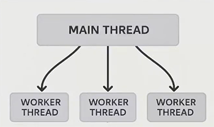

# Parallelism in Frontend
## Table of Contents
- [Into](#intro)
- [Web Workers](#web-workers)
  - [What are Web Workers?](#what-are-web-workers)
  - [Web Worker Types](#web-worker-types)
  - [How to Create a Worker?](#how-to-create-a-worker)
  - [Web Workers Limitations](#web-workers-limitations)
  - [Common Pitfalls to Consider when Working with Workers](#common-pitfalls-to-consider-when-working-with-workers)
- [OffscreenCanvas Interface](#offscreencanvas-interface)
  - [Asynchronous Display of Frames Produced by an OffscreenCanvas](#asynchronous-display-of-frames-produced-by-an-offscreencanvas)
- [ArrayBuffer](#arraybuffer)
  - [Transferring ArrayBuffers to Web Workers](#transferring-arraybuffers-to-web-workers)
- [SharedArrayBuffer](#sharedarraybuffer)
- [Multithreading Design Pattern: Worker Pools](#multithreading-design-pattern-worker-pools)
- [What's Next in Frontend Multithreading?](#whats-next-in-frontend-multithreading)
- [Documentation and References](#documentation-and-references)

## Intro
- **Parallelism** refers to the simultaneous execution of multiple tasks or operations, leveraging multiple CPU cores to improve performance.
- **Multithreading** is a technique that enables a program to execute multiple parts of its code, known as "threads", concurrently within a single process.
- Multithreading can enable parallelism.
- **Parallelism(multithreading)** in front-end can be achieved through the following concepts:
  - Web Workers
  - Offscreen Canvas
  - ArrayBuffer
  - SharedBuffer

## Web Workers

### What are Web Workers?
- **Web Workers** are a feature in web browsers that allow JavaScript code to run in a background thread, separate from the main browser thread thus creating the concept of true **parallelism(multithreading)**. This enables web applications to perform computationally intensive tasks without freezing or slowing down the responsiveness of the user interface.
- Web workers also can make network requests using the `fetch()` or `XMLHttpRequest APIs`. Once created, a worker can send messages to the JavaScript code that created it by posting messages to an event handler specified by that code (and vice versa).
- Web workers can't access the DOM (the window, document, page elements, and so on) because workers and the main code run in completely separate threads.



### Web Worker Types
There are a number of different types of workers:
- **Dedicated Workers**   
These are workers that are utilized by a single script. This context is represented by a DedicatedWorkerGlobalScope object.
- **Shared Workers**  
These are workers that can be utilized by multiple scripts running in different windows, IFrames, etc., as long as they are in the same domain as the worker. They are a little more complex than dedicated workers — scripts must communicate via an active port.
- **Service Workers**   
These workers essentially act as proxy servers that sit between web applications, the browser, and the network (when available). They are intended, among other things, to enable the creation of effective offline experiences, intercept network requests and take appropriate action based on whether the network is available, and update assets residing on the server. They will also allow access to push notifications and background sync APIs.
Basically service workers help to make web applications behave more like native apps.

### How to Create a Worker?
Let's go through simple dedicated worker creation steps. Let's consider `mail.js` is our main thread functionality and `worker.js` contains worker functionality.

#### Worker feature detection
For slightly more controlled error handling and backwards compatibility, it is a good idea to wrap your worker accessing code in the following(main.js):
   ```js
   // main.js
    if (window.Worker) {
    // …
}
  ```
#### Create a dedicated worker
In order to create a dedicated worker, all you need to do is call the Worker() constructor, specifying the URI of a script:
  ```js
   // main.js
   const myWorker = new Worker("worker.js");
}
  ```
***Note:*** Bundlers, including webpack, Vite, and Parcel, recommend passing URLs that are resolved relative to `import.meta.url` to the Worker() constructor. For example:
  ```js
   // main.js
   const myWorker = new Worker(new URL("worker.js", import.meta.url));
}
  ```
#### Sending messages to and from a dedicated worker
- In order to send a message between main thread and web worker, use `postMessage()`.
```js
   // main.js
    [first, second].forEach((input) => {
        input.onchange = () => {
            myWorker.postMessage([first.value, second.value]);
            console.log("Message posted to worker");
        };
    });
  ```
- In oder to receive a message, use `onmessage` event handler
```js
    // worker.js
    onmessage = (e) => {
        console.log("Message received from main script");
        const workerResult = `Result: ${e.data[0] * e.data[1]}`;
        console.log("Posting message back to main script");
        postMessage(workerResult);
    };
```
```js
    // main.js
    myWorker.onmessage = (e) => {
        result.textContent = e.data;
        console.log("Message received from worker");
    };
```
#### Terminating a Worker
Use this code to terminate a worker from `main.js`
```js
    // main.js
    myWorker.terminate();
```

### Web Workers Limitations
- ❌ No Direct DOM Access
- ❌ No Direct State Manipulation
- ❌ Limited Access to Browser APIs
- ❌ No Shared Memory with Main Thread

### Common Pitfalls to Consider when Working with Workers
- **Over threading** - Not everything needs a worker.   
- **Excessive communication** - Minimize message passing   
Minimize the size of the data you transfer between the main thread and the worker thread.
- **Forgetting termination** - Memory leaks from abandoned workers.    
Always terminate worker when it is not needed.
- **Poor error handling** - Workers can fail silently.   
Implement proper error handling in the workers.

## OffscreenCanvas Interface
When using the `<canvas>` element or the Canvas API, rendering, animation, and user interaction usually happen on the main execution thread of a web application. 
The computation relating to canvas animations and rendering can have a significant impact on application performance.   
- The **OffscreenCanvas interface** provides a canvas that can be rendered off-screen, decoupling the DOM and the Canvas API so that the `<canvas>` element is no longer entirely dependent on the DOM. 
- Rendering operations can also be run inside a worker context, allowing you to run some tasks in a separate thread and avoid heavy work on the main thread.   

While OffscreenCanvas interface can also be used in a synchronous way, we will discuss its usage in asynchronous way, with Web Workers.

### Asynchronous Display of Frames Produced by an OffscreenCanvas
In order to use `OffscreenCanvas API` in asynchronous way, you need to call `transferControlToOffscreen()` on a `<canvas>` element, either on a worker or the main thread, which will return an `OffscreenCanvas` object from an `HTMLCanvasElement` object from the main thread.   
Calling `getContext()` will then obtain a rendering context from that `OffscreenCanvas`.

The `main.js` script (main thread) may look like this:
```js
    // main.js
    const htmlCanvas = document.getElementById("canvas");
    const offscreen = htmlCanvas.transferControlToOffscreen();
    
    const worker = new Worker("offscreen-canvas.js");
    worker.postMessage({ canvas: offscreen }, [offscreen]);
```

The `offscreen-canvas.js` script (worker thread) can look like this:
```js
    // offscreen-canvas.js
    onmessage = (evt) => {
      const canvas = evt.data.canvas;
      const gl = canvas.getContext("webgl");
      // Perform some drawing using the gl context
      gl.clearRect(0, 0, canvasB.width, canvasB.height);
      ...
      gl.fillText(counter, canvasB.width / 2, canvasB.height / 2);
    };
```
It's also possible to use requestAnimationFrame() in workers:
```js
    // offscreen-canvas.js
    onmessage = (evt) => {
      const canvas = evt.data.canvas;
      const gl = canvas.getContext("webgl");
    
      function render(time) {
        // Perform some drawing using the gl context
        requestAnimationFrame(render);
      }
      requestAnimationFrame(render);
    };
```

## ArrayBuffer
- **ArrayBuffer** objects in JavaScript are used to represent generic, fixed-length raw binary data buffers.  
- It is an array of bytes, often referred to in other languages as a "byte array". You cannot directly manipulate the contents of an `ArrayBuffer`; instead, you create one of the [TypedArray objects](https://developer.mozilla.org/en-US/docs/Web/JavaScript/Reference/Global_Objects/TypedArray)(e.g., `Uint8Array`, `Float32Array`) or a [DataView](https://developer.mozilla.org/en-US/docs/Web/JavaScript/Reference/Global_Objects/DataView) object which represents the buffer in a specific format, and use that to read and write the contents of the buffer.
- They are `Transferable Objects` - particularly useful when working with `Web Workers` for efficient data transfer and manipulation of large binary datasets.

### Transferring ArrayBuffers to Web Workers

#### Create ArrayBuffer
An `ArrayBuffer` is created in the main thread, often populated with data using a `TypedArray` view:
```js
    // Main thread
    const buffer = new ArrayBuffer(1024); // 1KB buffer
    const view = new Uint8Array(buffer);
    for (let i = 0; i < view.length; i++) {
      view[i] = i % 256;
    }
```
#### Transferring Ownership
To send the `ArrayBuffer` to a Web Worker, use the `postMessage()` method of the `Worker` instance.  
It is important to specify the `ArrayBuffer` in the transferList second argument to transfer its ownership. This avoids copying the data, making it efficient for large buffers.
```js
    // Main thread
    const myWorker = new Worker('worker.js');
    myWorker.postMessage(buffer, [buffer]); // Transfer ownership
```
After transfer, the original buffer in the main thread becomes detached and its byteLength becomes 0. Attempts to access or modify it will result in errors.

#### Receiving and Working with ArrayBuffers in Web Workers
The `Web Worker` receives the transferred ArrayBuffer via its onmessage event handler. The `ArrayBuffer` will be available in the `e.data` property of the event object.
```js
    // Main thread
    onmessage = (evt) => {
      const receivedBuffer = evt.data;
      const receivedView = new Uint8Array(receivedBuffer);
      // Process the data in the worker
    };
```
The worker can then create `TypedArray` views on the received `ArrayBuffer` to access and manipulate the binary data.

## SharedArrayBuffer
`SharedArrayBuffer` in JavaScript represents a raw binary data buffer similar to the `ArrayBuffer` object, but in a way that it can be shared between multiple threads (e.g., the main thread and `Web Workers`) in a web application.    
Unlike `ArrayBuffer`, which is a `Transferable Object` and is transferred by making a copy when passed between threads, `SharedArrayBuffer` allows multiple threads to access and modify the same underlying memory space.

**Atomic Operations**  
To prevent race conditions and ensure data integrity when multiple threads access the same `SharedArrayBuffer`, `Atomics operations` are used. These operations provide low-level, thread-safe access to the shared memory.

**Security Context Requirement:**   
For security reasons, `SharedArrayBuffer` is typically only available in secure contexts (e.g., pages served over HTTPS) and often requires specific HTTP headers like `Cross-Origin-Opener-Policy: same-origin` and `Cross-Origin-Embedder-Policy: require-corp` to be enabled.

**Pass the SharedArrayBuffer to the worker**
```js
    // Main thread
    const sab = new SharedArrayBuffer(1024); // Create a SharedArrayBuffer of 1KB
    const view = new Int32Array(sab); // Create a typed array view of the buffer
    
    // Create a Web Worker
    const worker = new Worker('worker.js');
    
    // Pass the SharedArrayBuffer to the worker
    worker.postMessage({ buffer: sab });
```

```js
    // worker.js
   self.onmessage = (evt) => {
   const sab = evt.data.buffer;
   const view = new Int32Array(sab);

   // Perform operations on the shared buffer
   Atomics.add(view, 0, 10); // Atomically add 10 to the first element
};
```

## Multithreading Design Pattern: Worker Pools
**Web Worker Pools** in the browser, are a design pattern used to manage and optimize the execution of CPU-intensive or long-running tasks in a concurrent manner.
- Worker pools create a fixed number of dedicated worker threads (or web workers) that run in separate contexts, independent of the main thread. These workers are responsible for executing the demanding tasks.
- A central manager (the worker pool) maintains a queue of tasks waiting to be processed. When a worker becomes available, it picks a task from the queue and executes it. This ensures efficient resource utilization and prevents overwhelming the system.
- Libraries like `poolifier` can help manage a pool of Web Workers.

## When to use Multithreading?
This table provides general framework for making a decisions:
- When to use multi-threading? 
- Which tool to choose in case of specific problem.

⚠️ - this icon means that the decision depends on the specific case.    
For example simple animations can be offloaded to main thread while the ones which block user better to be offloaded to `Offscreencanvas`.  
✅ - this icons means that the decision is preferable.  
❌ - this icon means that the decision is not preferable.  

**Decision Framework**  

| Task Type            | Main Thread | Web Worker | OffscreenCanvas  |
|----------------------|-------------|------------|------------------|
| UI Updates           | ✅          | ❌         | ❌               |
| Data Processing      | ❌          | ✅         | ❌               |
| Complex Calculations | ❌          | ✅         | ❌               |
| Animations           | ⚠️          | ❌         | ✅               |
| Data Visualization   | ⚠️          | ⚠️         | ✅               |
| Network Requests     | ⚠️          | ✅         | ❌               |

## What's Next in Frontend Multithreading?
Here are teh concepts that describe the future of multi-threading in front-end:
- **Shared Memory Improvements** - Better Tools for Thread Synchronization
- **Worker Modules** - ES modules in Web Workers
- **Scheduler API** - More control over task prioritization
- **WebGPU** - GPU computing in the browser


## Documentation and References
- **Scaling React Apps with Parallelism: Patterns for Multi-Threaded UIs** - Presentation by [Shubham Gautam](https://www.linkedin.com/in/ishubham21/) at React Summit, June 2025.
- [Web Workers API](https://developer.mozilla.org/en-US/docs/Web/API/Web_Workers_API)
- [Using Web Workers](https://developer.mozilla.org/en-US/docs/Web/API/Web_Workers_API/Using_web_workers)
- [OffscreenCanvas](https://developer.mozilla.org/en-US/docs/Web/API/OffscreenCanvas)
- [ArrayBuffer](https://developer.mozilla.org/en-US/docs/Web/JavaScript/Reference/Global_Objects/ArrayBuffer)
- [SharedArrayBuffer](https://developer.mozilla.org/en-US/docs/Web/JavaScript/Reference/Global_Objects/SharedArrayBuffer)
- Demos
  - [Basic Dedicated Worker Example](https://github.com/mdn/dom-examples/tree/main/web-workers/simple-web-worker)
  - [Basic Shared Worker Example](https://github.com/mdn/dom-examples/tree/main/web-workers/simple-shared-worker) 
  - [Offscreen Canvas Worker Example](https://github.com/mdn/dom-examples/tree/main/web-workers/offscreen-canvas-worker)
